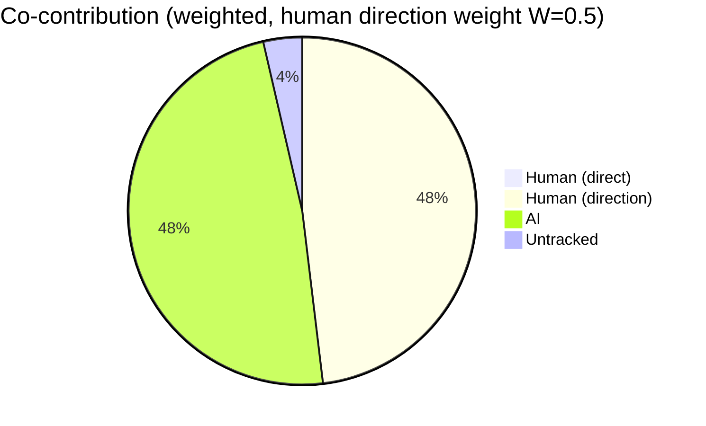
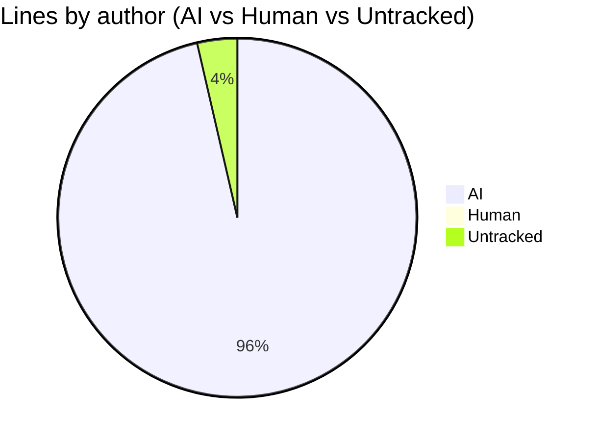
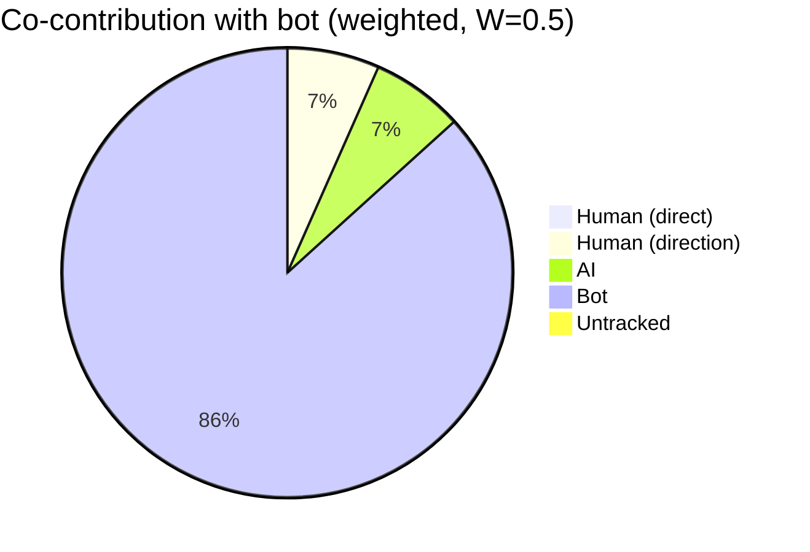
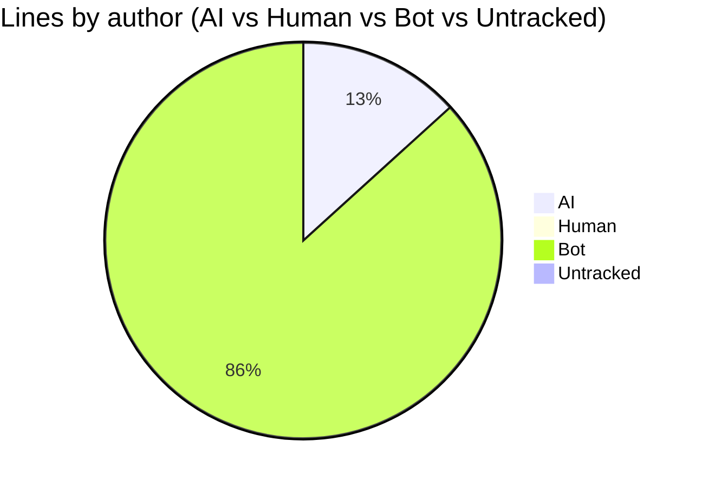
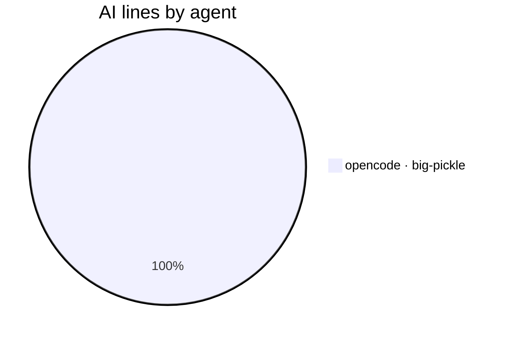
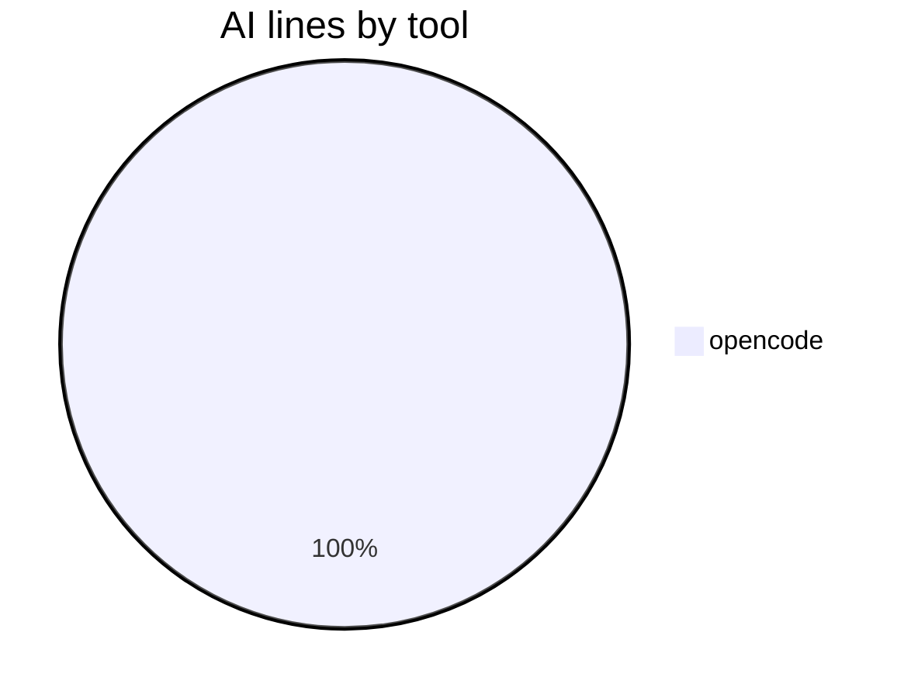
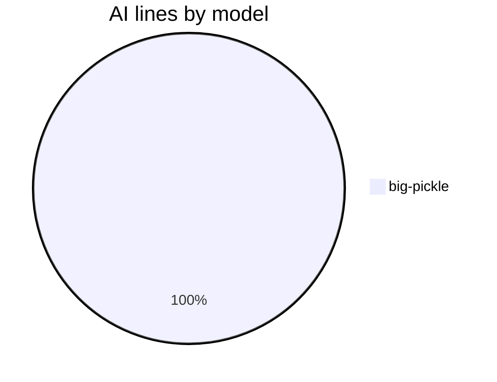

# AI Authorship Report

This file shows which AI coding agent (or human) wrote the code in each commit,
using the [git-ai](https://usegitai.com) attribution notes attached to every
commit. It is regenerated automatically by a GitHub Actions workflow on every
push to `main`.

## Summary

- Commits analyzed: **50** (last 50)
- Total lines added: **3643**
- **AI-generated:** 481 lines (13.2%)
- **Human:** 0 lines (0.0% of project)
- **Bot:** 3144 lines (86.3%) — excluded from pie
- **Untracked:** 18 lines (0.5%)
- **Human-directed AI:** 481 lines (weighted credit: 240 lines at W=0.5, 49.9% of project)
- **Agent-suggested ideas:** 0 AI lines (0.0% of AI; idea weight 0.3) — credit to human: 240 lines; credit to agent: 0 lines
- **Co-authored commits (human + AI lines):** 0
- **Agents:** opencode · big-pickle (481 lines)

## Composition



<details>
<summary>Show Strict AI/Human/Untracked</summary>



</details>

<details>
<summary>Show Weighted with bot commits</summary>



</details>

<details>
<summary>Show AI vs Human vs Bot (non-weighted)</summary>



</details>

<details>
<summary>Show AI lines by agent</summary>



</details>

<details>
<summary>Show AI lines by tool</summary>



</details>

<details>
<summary>Show AI lines by model</summary>



</details>

<details>
<summary>Legend — Human, AI, direction credit, and table markers</summary>

> **Agent format:** `opencode · big-pickle` = agent and the LLM model that
> generated the lines (model is recorded when git-ai can resolve it from the
> agent's session data).
>
> **Pie slices:** `Human (direct)` = human-written lines; `Human (direction)` =
> the credited share of AI lines from sessions whose human driver git-ai
> recorded (weight `W` = `REPORT_HUMAN_DIRECTION_WEIGHT`, default 0.5);
> `Agent (idea)` = lines implementing an idea the agent itself suggested
> earlier (via `Idea-By: agent` commit trailer), credited to the agent rather
> than the human who requested it (weight `I` = `REPORT_IDEA_WEIGHT`, default
> 0.3); `AI` = the AI lines not credited to the human (including autonomous
> AI with no recorded driver).
>
> **Table markers:** `✓` = co-authored commit (contains both human-written
> and AI lines); `A` = commit whose idea the agent originated.
>
> **Other:** `bot` = committed by an automated account (`github-actions[bot]`
> and other `[bot]` accounts) — known authorship, not attributed through
> git-ai. `untracked` = lines with no attribution data — written before
> git-ai was set up or made in the github.com web UI (cannot be retroactively
> attributed). `human` = written directly by a human and recorded via
> `git-ai checkpoint human` or the git-ai extension.
>
> **Config:** these are line-count percentages, not commit counts. The
> composition pie excludes the report's own `bot` commits by default; set
> `REPORT_SHOW_BOT_CHART=1` to include them, or `REPORT_SHOW_DIRECTION=0`
> for a strict AI/Human/Untracked line-count pie. The "AI lines by tool" and
> "AI lines by model" pies break down the AI attribution by the agent tool
> and LLM model that produced the lines. "Human lines by contributor" shows
> human-written lines broken down by the commit author who recorded them (via
> `git-ai checkpoint human`).

</details>

## Per-commit breakdown

| Commit | Date | Message | Lines | AI | Human | Co | Idea | Agent(s) |
| --- | --- | --- | --- | --- | --- | --- | --- | --- |
| 2df016c | 2026-08-17 | feat: collapse all charts except top, add per-chart visibility | 18 | 0% | 0% |  |  | untracked |
| e2ba071 | 2026-08-18 | docs: regenerate AI authorship report | 149 | 0% | 0% |  |  | bot |
| dce3cde | 2026-08-17 | feat: REPORT_DEFAULT_CHART flag to choose which chart is expanded | 28 | 100% | 0% |  |  | opencode · big-pickle |
| da153cf | 2026-08-18 | docs: regenerate AI authorship report | 147 | 0% | 0% |  |  | bot |
| 3007fe1 | 2026-08-17 | feat: add non-weighted with bot chart to collapsible options | 17 | 100% | 0% |  |  | opencode · big-pickle |
| 9077c30 | 2026-08-18 | docs: regenerate AI authorship report | 147 | 0% | 0% |  |  | bot |
| db05a6b | 2026-08-17 | feat: collapsible alternative charts (strict + bot-included) | 49 | 100% | 0% |  |  | opencode · big-pickle |
| 6c835be | 2026-08-17 | docs: regenerate AI authorship report | 116 | 0% | 0% |  |  | bot |
| 7275fa0 | 2026-08-17 | feat: note 'not shown in strict pie' when direction is off | 2 | 100% | 0% |  |  | opencode · big-pickle |
| 2c4ee3b | 2026-08-17 | docs: regenerate AI authorship report | 120 | 0% | 0% |  |  | bot |
| 86120c0 | 2026-08-17 | feat: note 'excluded from pie' on bot line when hidden | 1 | 100% | 0% |  |  | opencode · big-pickle |
| e55510f | 2026-08-17 | docs: regenerate AI authorship report | 120 | 0% | 0% |  |  | bot |
| edbffab | 2026-08-17 | chore: hide bot chart on ai-authorship (match consumers) | 1 | 100% | 0% |  |  | opencode · big-pickle |
| aed3041 | 2026-08-17 | docs: regenerate AI authorship report | 121 | 0% | 0% |  |  | bot |
| 5b14f52 | 2026-08-17 | chore: add Mahjong_Testing to sync-consumers | 1 | 100% | 0% |  |  | opencode · big-pickle |
| a9fc3b1 | 2026-08-17 | docs: regenerate AI authorship report | 157 | 0% | 0% |  |  | bot |
| 763ed32 | 2026-08-17 | feat: make legend collapsible in report | 36 | 100% | 0% |  |  | opencode · big-pickle |
| 64f84b9 | 2026-08-17 | docs: regenerate AI authorship report | 121 | 0% | 0% |  |  | bot |
| f0043ab | 2026-08-17 | docs: add issue/PR links to suggest line | 1 | 100% | 0% |  |  | opencode · big-pickle |
| 760e469 | 2026-08-17 | docs: regenerate AI authorship report | 122 | 0% | 0% |  |  | bot |
| ea4994c | 2026-08-17 | docs: move Ollama to Future Testing section | 5 | 100% | 0% |  |  | opencode · big-pickle |
| 8160c36 | 2026-08-17 | docs: regenerate AI authorship report | 121 | 0% | 0% |  |  | bot |
| 92ad9b8 | 2026-08-17 | docs: move badges under title | 2 | 100% | 0% |  |  | opencode · big-pickle |
| 6b690b4 | 2026-08-17 | docs: regenerate AI authorship report | 106 | 0% | 0% |  |  | bot |
| d12d21b | 2026-08-17 | docs: move local models to bottom of agent list | 2 | 100% | 0% |  |  | opencode · big-pickle |
| 93b6973 | 2026-08-17 | docs: regenerate AI authorship report | 121 | 0% | 0% |  |  | bot |
| 531b635 | 2026-08-17 | docs: split LM Studio and Ollama in agent list | 2 | 100% | 0% |  |  | opencode · big-pickle |
| c5c90fa | 2026-08-17 | docs: regenerate AI authorship report | 163 | 0% | 0% |  |  | bot |
| 4134116 | 2026-08-17 | docs: restructure README — quick start at top, LM Studio/Ollama split | 114 | 100% | 0% |  |  | opencode · big-pickle |
| 878ccd8 | 2026-08-17 | docs: regenerate AI authorship report | 132 | 0% | 0% |  |  | bot |
| 8e73951 | 2026-08-17 | chore: move VALUE-PROPOSITION.md to local-only (gitignored) | 1 | 100% | 0% |  |  | opencode · big-pickle |
| feab192 | 2026-08-17 | docs: regenerate AI authorship report | 133 | 0% | 0% |  |  | bot |
| 6582e48 | 2026-08-17 | docs: merge research + competition insights into value proposition | 80 | 100% | 0% |  |  | opencode · big-pickle |
| e8ee529 | 2026-08-17 | docs: regenerate AI authorship report | 132 | 0% | 0% |  |  | bot |
| 46937b5 | 2026-08-16 | docs: add value proposition internal doc | 50 | 100% | 0% |  |  | opencode · big-pickle |
| 1f2e00b | 2026-08-17 | docs: regenerate AI authorship report | 137 | 0% | 0% |  |  | bot |
| a51d345 | 2026-08-16 | docs: add agent chart toggle to workflows guide | 13 | 100% | 0% |  |  | opencode · big-pickle |
| f3e7a21 | 2026-08-17 | docs: regenerate AI authorship report | 97 | 0% | 0% |  |  | bot |
| 22fede2 | 2026-08-16 | feat: add REPORT_SHOW_AGENT_CHART toggle for agent breakdown pie | 9 | 100% | 0% |  |  | opencode · big-pickle |
| 00a67d2 | 2026-08-17 | docs: regenerate AI authorship report | 122 | 0% | 0% |  |  | bot |
| 4a97616 | 2026-08-16 | fix: Human percentage now uses project total (excluding bot) to match pie chart | 1 | 100% | 0% |  |  | opencode · big-pickle |
| 76e3f51 | 2026-08-17 | docs: regenerate AI authorship report | 121 | 0% | 0% |  |  | bot |
| a6e8045 | 2026-08-16 | fix: change human-directed AI percentage to match pie chart | 1 | 100% | 0% |  |  | opencode · big-pickle |
| 07472cc | 2026-08-17 | docs: regenerate AI authorship report | 107 | 0% | 0% |  |  | bot |
| 2e6ae12 | 2026-08-16 | fix: add weighted percentage to human-directed AI text | 1 | 100% | 0% |  |  | opencode · big-pickle |
| afeba20 | 2026-08-17 | docs: regenerate AI authorship report | 119 | 0% | 0% |  |  | bot |
| 28155af | 2026-08-16 | fix: clarify human-directed AI text to show weighted credit matching pie chart | 1 | 100% | 0% |  |  | opencode · big-pickle |
| 274a33f | 2026-08-17 | docs: regenerate AI authorship report | 90 | 0% | 0% |  |  | bot |
| 6d609e2 | 2026-08-16 | feat: add Human lines by contributor pie to the composition section | 63 | 100% | 0% |  |  | opencode · big-pickle |
| 3910014 | 2026-08-17 | docs: regenerate AI authorship report | 123 | 0% | 0% |  |  | bot |

## Raw git-ai log (last 25 commits)

<details>
<summary>Show raw attribution detail</summary>

```text
commit 2df016c373a694df64fa9dfe6e5a93baaa72aa4d (HEAD -> main, origin/main)
Author: CaliMark <mreed@needpc.net>
Date:   2026-08-17T21:19:18-07:00

    feat: collapse all charts except top, add per-chart visibility

    Git AI stats:
      you  ········································ ai
           0%           untracked 100%            0%

    Authorship note:
      (none)

commit e2ba071d38d1788627f3c8602661cbd1b3e3bbe9
Author: github-actions[bot] <41898282+github-actions[bot]@users.noreply.github.com>
Date:   2026-08-18T03:10:38Z

    docs: regenerate AI authorship report

    Git AI stats:
      you  ········································ ai
           0%           untracked 100%            0%

    Authorship note:
      (none)

commit dce3cde13e2a5fb245b588fa0112ab73af4b88ee
Author: CaliMark <mreed@needpc.net>
Date:   2026-08-17T20:10:03-07:00

    feat: REPORT_DEFAULT_CHART flag to choose which chart is expanded

    Git AI stats:
      you  ░░░░░░░░░░░░░░░░░░░░░░░░░░░░░░░░░░░░░░░░ ai
           0%                                  100%

    Authorship note:
      scripts/authorship-report.sh
        s_52d0732141ad88::t_70f6f84bf4d21c 509
        s_52d0732141ad88::t_b8af4831269dc0 102-108
        s_52d0732141ad88::t_7e6dbae47b4c2f 471-486
      workflow/authorship-report.yml
        s_52d0732141ad88::t_160faa6297e071 46-48
      README.md
        s_52d0732141ad88::t_72c5cee8b3ee60 454
      ---
      {
        "schema_version": "authorship/3.0.0",
        "git_ai_version": "1.6.22",
        "base_commit_sha": "dce3cde13e2a5fb245b588fa0112ab73af4b88ee",
        "prompts": {},
        "sessions": {
          "s_52d0732141ad88": {
            "agent_id": {
              "tool": "opencode",
              "id": "ses_008f7fcbaffeQRUMaWQo3qCxm4",
              "model": "big-pickle"
            },
            "human_author": "CaliMark <mreed@needpc.net>"
          }
        }
      }

commit da153cf696c3dff81bd84ff77c96a4bd59d7462e
Author: github-actions[bot] <41898282+github-actions[bot]@users.noreply.github.com>
Date:   2026-08-18T02:18:15Z

    docs: regenerate AI authorship report

    Git AI stats:
      you  ········································ ai
           0%           untracked 100%            0%

    Authorship note:
      (none)

commit 3007fe1c027e1c5dc20708a2b387583bfbb4811c
Author: CaliMark <mreed@needpc.net>
Date:   2026-08-17T19:17:44-07:00

    feat: add non-weighted with bot chart to collapsible options

    Git AI stats:
      you  ░░░░░░░░░░░░░░░░░░░░░░░░░░░░░░░░░░░░░░░░ ai
           0%                                  100%

    Authorship note:
      scripts/authorship-report.sh
        s_52d0732141ad88::t_7dcd0c3e8b0af3 454-463
        s_52d0732141ad88::t_5db1b7b6f2d83f 511-516
        s_30f00a1884ee3d::t_523df9d0298809 510
      ---
      {
        "schema_version": "authorship/3.0.0",
        "git_ai_version": "1.6.22",
        "base_commit_sha": "3007fe1c027e1c5dc20708a2b387583bfbb4811c",
        "prompts": {},
        "sessions": {
          "s_30f00a1884ee3d": {
            "agent_id": {
              "tool": "opencode",
              "id": "ses_0251ccc8bffeRD38fJ4fosd3c2",
              "model": "big-pickle"
            },
            "human_author": "CaliMark <mreed@needpc.net>"
          },
          "s_52d0732141ad88": {
            "agent_id": {
              "tool": "opencode",
              "id": "ses_008f7fcbaffeQRUMaWQo3qCxm4",
              "model": "big-pickle"
            },
            "human_author": "CaliMark <mreed@needpc.net>"
          }
        }
      }

commit 9077c30c113147c701d89fc15a1650cd210688a1
Author: github-actions[bot] <41898282+github-actions[bot]@users.noreply.github.com>
Date:   2026-08-18T02:08:25Z

    docs: regenerate AI authorship report

    Git AI stats:
      you  ········································ ai
           0%           untracked 100%            0%

    Authorship note:
      (none)

commit db05a6b3f0ecfe20af91484e0d4daa9373e4a824
Author: CaliMark <mreed@needpc.net>
Date:   2026-08-17T19:07:52-07:00

    feat: collapsible alternative charts (strict + bot-included)

    Git AI stats:
      you  ░░░░░░░░░░░░░░░░░░░░░░░░░░░░░░░░░░░░░░░░ ai
           0%                                  100%

    Authorship note:
      scripts/authorship-report.sh
        s_52d0732141ad88::t_da5f575fd7dd5c 419-453
        s_52d0732141ad88::t_2bec1d6b49ed37 486-499
      ---
      {
        "schema_version": "authorship/3.0.0",
        "git_ai_version": "1.6.22",
        "base_commit_sha": "db05a6b3f0ecfe20af91484e0d4daa9373e4a824",
        "prompts": {},
        "sessions": {
          "s_52d0732141ad88": {
            "agent_id": {
              "tool": "opencode",
              "id": "ses_008f7fcbaffeQRUMaWQo3qCxm4",
              "model": "big-pickle"
            },
            "human_author": "CaliMark <mreed@needpc.net>"
          }
        }
      }

commit 6c835be7ee360f15d924c5cec1eb233caa3e0327
Author: github-actions[bot] <41898282+github-actions[bot]@users.noreply.github.com>
Date:   2026-08-17T21:41:57Z

    docs: regenerate AI authorship report

    Git AI stats:
      you  ········································ ai
           0%           untracked 100%            0%

    Authorship note:
      (none)

commit 7275fa05fbb6953458df5b4b655668b3fa80eab3
Author: CaliMark <mreed@needpc.net>
Date:   2026-08-17T14:41:29-07:00

    feat: note 'not shown in strict pie' when direction is off

    Git AI stats:
      you  ░░░░░░░░░░░░░░░░░░░░░░░░░░░░░░░░░░░░░░░░ ai
           0%                                  100%

    Authorship note:
      scripts/authorship-report.sh
        s_52d0732141ad88::t_5a629af901e2fc 434-435
      ---
      {
        "schema_version": "authorship/3.0.0",
        "git_ai_version": "1.6.22",
        "base_commit_sha": "7275fa05fbb6953458df5b4b655668b3fa80eab3",
        "prompts": {},
        "sessions": {
          "s_52d0732141ad88": {
            "agent_id": {
              "tool": "opencode",
              "id": "ses_008f7fcbaffeQRUMaWQo3qCxm4",
              "model": "big-pickle"
            },
            "human_author": "CaliMark <mreed@needpc.net>"
          }
        }
      }

commit 2c4ee3b6ad8e33e07761dc033b0cbdd1b5c433d9
Author: github-actions[bot] <41898282+github-actions[bot]@users.noreply.github.com>
Date:   2026-08-17T21:29:05Z

    docs: regenerate AI authorship report

    Git AI stats:
      you  ········································ ai
           0%           untracked 100%            0%

    Authorship note:
      (none)

commit 86120c0ab47c1a118d3cc68f2cf3d37c2c679e20
Author: CaliMark <mreed@needpc.net>
Date:   2026-08-17T14:28:36-07:00

    feat: note 'excluded from pie' on bot line when hidden

    Git AI stats:
      you  ░░░░░░░░░░░░░░░░░░░░░░░░░░░░░░░░░░░░░░░░ ai
           0%                                  100%

    Authorship note:
      scripts/authorship-report.sh
        s_52d0732141ad88::t_083585b9bef1f6 432
      ---
      {
        "schema_version": "authorship/3.0.0",
        "git_ai_version": "1.6.22",
        "base_commit_sha": "86120c0ab47c1a118d3cc68f2cf3d37c2c679e20",
        "prompts": {},
        "sessions": {
          "s_52d0732141ad88": {
            "agent_id": {
              "tool": "opencode",
              "id": "ses_008f7fcbaffeQRUMaWQo3qCxm4",
              "model": "big-pickle"
            },
            "human_author": "CaliMark <mreed@needpc.net>"
          }
        }
      }

commit e55510f4f75a0e88b98e27166a10ce792e4a980a
Author: github-actions[bot] <41898282+github-actions[bot]@users.noreply.github.com>
Date:   2026-08-17T21:24:27Z

    docs: regenerate AI authorship report

    Git AI stats:
      you  ········································ ai
           0%           untracked 100%            0%

    Authorship note:
      (none)

commit edbffab395904e385a2e1224c652e9aecc0d95a6
Author: CaliMark <mreed@needpc.net>
Date:   2026-08-17T14:23:59-07:00

    chore: hide bot chart on ai-authorship (match consumers)

    Git AI stats:
      you  ░░░░░░░░░░░░░░░░░░░░░░░░░░░░░░░░░░░░░░░░ ai
           0%                                  100%

    Authorship note:
      .github/workflows/authorship-report.yml
        s_52d0732141ad88::t_d4adf6f9478508 32
      ---
      {
        "schema_version": "authorship/3.0.0",
        "git_ai_version": "1.6.22",
        "base_commit_sha": "edbffab395904e385a2e1224c652e9aecc0d95a6",
        "prompts": {},
        "sessions": {
          "s_52d0732141ad88": {
            "agent_id": {
              "tool": "opencode",
              "id": "ses_008f7fcbaffeQRUMaWQo3qCxm4",
              "model": "big-pickle"
            },
            "human_author": "CaliMark <mreed@needpc.net>"
          }
        }
      }

commit aed3041d0de275b48d8eda3e372270d87174c3aa
Author: github-actions[bot] <41898282+github-actions[bot]@users.noreply.github.com>
Date:   2026-08-17T21:21:27Z

    docs: regenerate AI authorship report

    Git AI stats:
      you  ········································ ai
           0%           untracked 100%            0%

    Authorship note:
      (none)

commit 5b14f52392d221c8742b9e3f9e0b6d9e6161709a
Author: CaliMark <mreed@needpc.net>
Date:   2026-08-17T14:20:58-07:00

    chore: add Mahjong_Testing to sync-consumers

    Git AI stats:
      you  ░░░░░░░░░░░░░░░░░░░░░░░░░░░░░░░░░░░░░░░░ ai
           0%                                  100%

    Authorship note:
      scripts/sync-consumers.sh
        s_52d0732141ad88::t_9d5e9a6c32a9fb 38
      ---
      {
        "schema_version": "authorship/3.0.0",
        "git_ai_version": "1.6.22",
        "base_commit_sha": "5b14f52392d221c8742b9e3f9e0b6d9e6161709a",
        "prompts": {},
        "sessions": {
          "s_52d0732141ad88": {
            "agent_id": {
              "tool": "opencode",
              "id": "ses_008f7fcbaffeQRUMaWQo3qCxm4",
              "model": "big-pickle"
            },
            "human_author": "CaliMark <mreed@needpc.net>"
          }
        }
      }

commit a9fc3b17c8ec580091247bb681a4854680b59668
Author: github-actions[bot] <41898282+github-actions[bot]@users.noreply.github.com>
Date:   2026-08-17T21:18:56Z

    docs: regenerate AI authorship report

    Git AI stats:
      you  ········································ ai
           0%           untracked 100%            0%

    Authorship note:
      (none)

commit 763ed3252db5d6ddc24b4c5017638176ad1e7f9f
Author: CaliMark <mreed@needpc.net>
Date:   2026-08-17T14:18:15-07:00

    feat: make legend collapsible in report

    Git AI stats:
      you  ░░░░░░░░░░░░░░░░░░░░░░░░░░░░░░░░░░░░░░░░ ai
           0%                                  100%

    Authorship note:
      scripts/authorship-report.sh
        s_52d0732141ad88::t_41921f395fd4ac 451-486
      ---
      {
        "schema_version": "authorship/3.0.0",
        "git_ai_version": "1.6.22",
        "base_commit_sha": "763ed3252db5d6ddc24b4c5017638176ad1e7f9f",
        "prompts": {},
        "sessions": {
          "s_52d0732141ad88": {
            "agent_id": {
              "tool": "opencode",
              "id": "ses_008f7fcbaffeQRUMaWQo3qCxm4",
              "model": "big-pickle"
            },
            "human_author": "CaliMark <mreed@needpc.net>"
          }
        }
      }

commit 64f84b9fa423aa6863332f4899b96ab4117c26c9
Author: github-actions[bot] <41898282+github-actions[bot]@users.noreply.github.com>
Date:   2026-08-17T21:06:04Z

    docs: regenerate AI authorship report

    Git AI stats:
      you  ········································ ai
           0%           untracked 100%            0%

    Authorship note:
      (none)

commit f0043abda3b444f148841a9e0af0c1dce9eb2634
Author: CaliMark <mreed@needpc.net>
Date:   2026-08-17T14:05:27-07:00

    docs: add issue/PR links to suggest line

    Git AI stats:
      you  ░░░░░░░░░░░░░░░░░░░░░░░░░░░░░░░░░░░░░░░░ ai
           0%                                  100%

    Authorship note:
      README.md
        s_52d0732141ad88::t_52cbe5919f7f0e 184
      ---
      {
        "schema_version": "authorship/3.0.0",
        "git_ai_version": "1.6.22",
        "base_commit_sha": "f0043abda3b444f148841a9e0af0c1dce9eb2634",
        "prompts": {},
        "sessions": {
          "s_52d0732141ad88": {
            "agent_id": {
              "tool": "opencode",
              "id": "ses_008f7fcbaffeQRUMaWQo3qCxm4",
              "model": "big-pickle"
            },
            "human_author": "CaliMark <mreed@needpc.net>"
          }
        }
      }

commit 760e4693d1386892e871cf40511a0f6d8a3b3d3f
Author: github-actions[bot] <41898282+github-actions[bot]@users.noreply.github.com>
Date:   2026-08-17T21:00:17Z

    docs: regenerate AI authorship report

    Git AI stats:
      you  ········································ ai
           0%           untracked 100%            0%

    Authorship note:
      (none)

commit ea4994c282d0179b356cedb6e558f5260a23bc3e
Author: CaliMark <mreed@needpc.net>
Date:   2026-08-17T13:59:42-07:00

    docs: move Ollama to Future Testing section

    Git AI stats:
      you  ░░░░░░░░░░░░░░░░░░░░░░░░░░░░░░░░░░░░░░░░ ai
           0%                                  100%

    Authorship note:
      README.md
        s_52d0732141ad88::t_01ed7e49098cea 180-183
        s_52d0732141ad88::t_187c84cfee2d60 79
      ---
      {
        "schema_version": "authorship/3.0.0",
        "git_ai_version": "1.6.22",
        "base_commit_sha": "ea4994c282d0179b356cedb6e558f5260a23bc3e",
        "prompts": {},
        "sessions": {
          "s_52d0732141ad88": {
            "agent_id": {
              "tool": "opencode",
              "id": "ses_008f7fcbaffeQRUMaWQo3qCxm4",
              "model": "big-pickle"
            },
            "human_author": "CaliMark <mreed@needpc.net>"
          }
        }
      }

commit 8160c36c6e5ecaacd7ab5b2c00a4b1f4e9edbe83
Author: github-actions[bot] <41898282+github-actions[bot]@users.noreply.github.com>
Date:   2026-08-17T20:55:13Z

    docs: regenerate AI authorship report

    Git AI stats:
      you  ········································ ai
           0%           untracked 100%            0%

    Authorship note:
      (none)

commit 92ad9b8c4b8bbeb5d2c3b9c9ea2787a97180f896
Author: CaliMark <mreed@needpc.net>
Date:   2026-08-17T13:54:33-07:00

    docs: move badges under title

    Git AI stats:
      you  ░░░░░░░░░░░░░░░░░░░░░░░░░░░░░░░░░░░░░░░░ ai
           0%                                  100%

    Authorship note:
      README.md
        s_52d0732141ad88::t_da2d0b33ad4d3e 8-9
      ---
      {
        "schema_version": "authorship/3.0.0",
        "git_ai_version": "1.6.22",
        "base_commit_sha": "92ad9b8c4b8bbeb5d2c3b9c9ea2787a97180f896",
        "prompts": {},
        "sessions": {
          "s_52d0732141ad88": {
            "agent_id": {
              "tool": "opencode",
              "id": "ses_008f7fcbaffeQRUMaWQo3qCxm4",
              "model": "big-pickle"
            },
            "human_author": "CaliMark <mreed@needpc.net>"
          }
        }
      }

commit 6b690b457eee75a5680a29b309686ea9b046c95b
Author: github-actions[bot] <41898282+github-actions[bot]@users.noreply.github.com>
Date:   2026-08-17T20:33:55Z

    docs: regenerate AI authorship report

    Git AI stats:
      you  ········································ ai
           0%           untracked 100%            0%

    Authorship note:
      (none)

commit d12d21b671ef906226735fe193e83464783c8c65
Author: CaliMark <mreed@needpc.net>
Date:   2026-08-17T13:33:23-07:00

    docs: move local models to bottom of agent list

    Git AI stats:
      you  ░░░░░░░░░░░░░░░░░░░░░░░░░░░░░░░░░░░░░░░░ ai
           0%                                  100%

    Authorship note:
      README.md
        s_52d0732141ad88::t_b982dcd733671d 58-59
      ---
      {
        "schema_version": "authorship/3.0.0",
        "git_ai_version": "1.6.22",
        "base_commit_sha": "d12d21b671ef906226735fe193e83464783c8c65",
        "prompts": {},
        "sessions": {
          "s_52d0732141ad88": {
            "agent_id": {
              "tool": "opencode",
              "id": "ses_008f7fcbaffeQRUMaWQo3qCxm4",
              "model": "big-pickle"
            },
            "human_author": "CaliMark <mreed@needpc.net>"
          }
        }
      }


```
</details>

---

_Generated by [git-ai](https://usegitai.com). See `git ai blame <file>` for
line-level attribution of any file._
