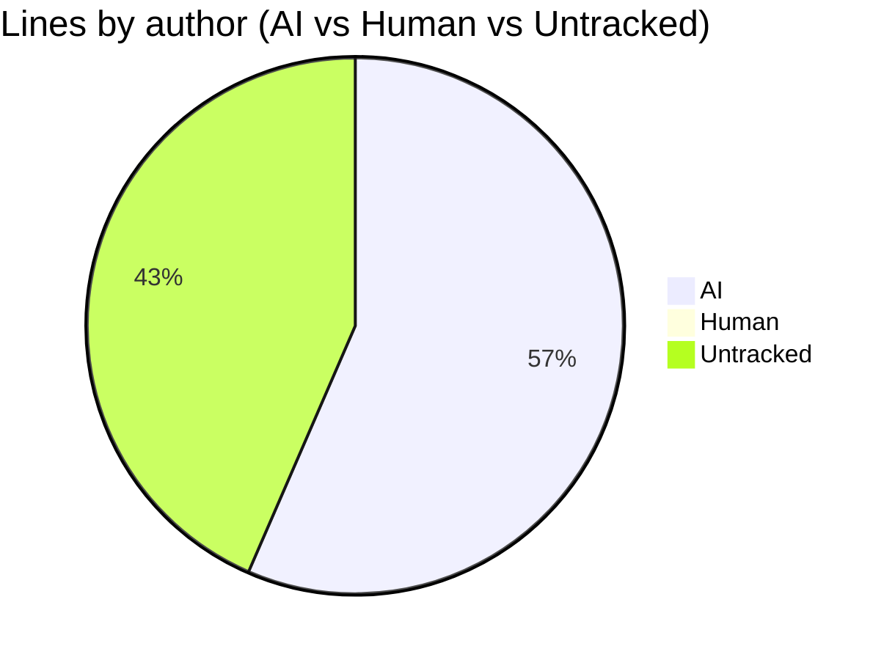
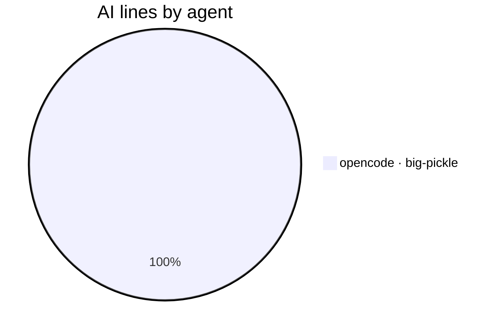

# AI Authorship Report

This file shows which AI coding agent (or human) wrote the code in each commit,
using the [git-ai](https://usegitai.com) attribution notes attached to every
commit. It is regenerated automatically by a GitHub Actions workflow on every
push to `main`.

## Summary

- Commits analyzed: **50** (last 50)
- Total lines added: **3585**
- **AI-generated:** 2026 lines (56.5%)
- **Human:** 0 lines (0.0%)
- **Untracked:** 1559 lines (43.5%)
- **Agents:** opencode · big-pickle (2026 lines)

## Composition





> **Legend:** `opencode · big-pickle` = agent and the LLM model that generated
> the lines (model is recorded when git-ai can resolve it from the agent's
> session data). `untracked` = lines with no attribution data — written before
> git-ai was set up, made in the github.com web UI, or created by CI bots
> (cannot be retroactively attributed). `human` = written directly by a human
> and recorded via `git-ai checkpoint human` or the git-ai extension. Note:
> these are line-count percentages, not commit counts.

## Per-commit breakdown

| Commit | Date | Message | Lines | AI | Human | Agent(s) |
| --- | --- | --- | --- | --- | --- | --- |
| a3b4f73 | 2026-08-16 | docs: regenerate AI authorship report | 69 | 0% | 0% | untracked |
| 4fd1f6d | 2026-08-16 | feat: add mermaid composition pie chart to AI authorship report | 58 | 100% | 0% | opencode · big-pickle |
| dc219ff | 2026-08-16 | docs: regenerate AI authorship report | 151 | 0% | 0% | untracked |
| d95e7d3 | 2026-08-16 | docs: regenerate AI authorship report with JSON twin | 823 | 100% | 0% | opencode · big-pickle |
| 4d898b8 | 2026-08-16 | feat: emit machine-readable AI-AUTHORSHIP.json; document manual-policy case study and human-review future idea | 115 | 100% | 0% | opencode · big-pickle |
| 90aece2 | 2026-08-16 | docs: regenerate AI authorship report | 51 | 0% | 0% | untracked |
| 6bb37ac | 2026-08-15 | docs: list Local models via OpenCode as first out-of-the-box option | 2 | 100% | 0% | opencode · big-pickle |
| bc38201 | 2026-08-16 | docs: regenerate AI authorship report | 53 | 0% | 0% | untracked |
| 6cdd963 | 2026-08-15 | docs: promote LM Studio to Agent Support (tested & verified), keep Currently Testing as suggestion channel | 35 | 100% | 0% | opencode · big-pickle |
| c7b38d5 | 2026-08-16 | docs: regenerate AI authorship report | 52 | 0% | 0% | untracked |
| 3db2752 | 2026-08-15 | docs: note game-of-life local-model (LM Studio) proof as 8th attribution source | 7 | 100% | 0% | opencode · big-pickle |
| 22f81a9 | 2026-08-15 | docs: regenerate AI authorship report | 54 | 0% | 0% | untracked |
| 2f5d298 | 2026-08-15 | docs: mark local models (LM Studio + qwen2.5-7b-instruct) as verified live, document qwen2.5-coder tool-call failure | 17 | 100% | 0% | opencode · big-pickle |
| ade987c | 2026-08-15 | docs: regenerate AI authorship report | 54 | 0% | 0% | untracked |
| 4a6e461 | 2026-08-14 | docs: add community tagline callout and Currently Testing section with LM Studio self-hosted setup | 26 | 100% | 0% | opencode · big-pickle |
| 37c930a | 2026-08-15 | docs: regenerate AI authorship report | 57 | 0% | 0% | untracked |
| f9fd6f2 | 2026-08-14 | docs: strengthen AI code attribution keywords in headings and intro for indexing | 6 | 100% | 0% | opencode · big-pickle |
| dbdba5c | 2026-08-15 | docs: regenerate AI authorship report | 62 | 0% | 0% | untracked |
| a211e22 | 2026-08-14 | docs: bundle native agents into one Quick Start section, trim duplicate notes and requirements | 26 | 100% | 0% | opencode · big-pickle |
| 0f995ea | 2026-08-15 | docs: regenerate AI authorship report | 52 | 0% | 0% | untracked |
| 487cb82 | 2026-08-14 | docs: consolidate native-hook agents into one row in Agent Support table | 1 | 100% | 0% | opencode · big-pickle |
| 382ae1e | 2026-08-15 | docs: regenerate AI authorship report | 53 | 0% | 0% | untracked |
| 9c03147 | 2026-08-14 | docs: split Agent Support into tested vs untested checkpoint presets | 20 | 100% | 0% | opencode · big-pickle |
| a02d433 | 2026-08-15 | docs: regenerate AI authorship report | 55 | 0% | 0% | untracked |
| 118047e | 2026-08-14 | docs: fix integration count, drop Windsurf/Continue refs, add hobbyist note and free-tier asterisks | 11 | 100% | 0% | opencode · big-pickle |
| 3be921f | 2026-08-15 | docs: regenerate AI authorship report | 52 | 0% | 0% | untracked |
| 5582168 | 2026-08-14 | chore: gitignore private competition reference notes | 1 | 100% | 0% | opencode · big-pickle |
| 7877d8a | 2026-08-15 | docs: regenerate AI authorship report | 93 | 0% | 0% | untracked |
| e635355 | 2026-08-14 | docs: expand live demo note, link both public repos, fix local file:// links | 10 | 100% | 0% | opencode · big-pickle |
| 907fb12 | 2026-08-14 | docs: move workflows reference to docs/workflows.md, link from README | 109 | 100% | 0% | opencode · big-pickle |
| 9acc1c7 | 2026-08-15 | docs: regenerate AI authorship report | 54 | 0% | 0% | untracked |
| ba7e6bd | 2026-08-14 | docs: add bridge.zip release download instructions, note clone option | 17 | 100% | 0% | opencode · big-pickle |
| 4aae280 | 2026-08-15 | docs: regenerate AI authorship report | 59 | 0% | 0% | untracked |
| 7fdaec7 | 2026-08-14 | fix(devin): attribute Devin edits as devin via agent-v1 preset instead of claude | 51 | 100% | 0% | opencode · big-pickle |
| 2a38a48 | 2026-08-14 | docs: regenerate AI authorship report | 70 | 0% | 0% | untracked |
| 7452c9a | 2026-08-13 | docs: document Devin Desktop attribution via .devin hooks + bridge | 185 | 100% | 0% | opencode · big-pickle |
| 58e6850 | 2026-08-14 | docs: regenerate AI authorship report | 73 | 0% | 0% | untracked |
| 2d5c04c | 2026-08-13 | docs: document Cline CLI + extension attribution and git-ai extension conflict | 248 | 100% | 0% | opencode · big-pickle |
| d5b1944 | 2026-08-13 | docs: regenerate AI authorship report | 60 | 0% | 0% | untracked |
| a49e791 | 2026-08-13 | docs: document native Cursor hooks integration | 46 | 100% | 0% | opencode · big-pickle |
| 5c2e5b9 | 2026-08-13 | docs: regenerate AI authorship report | 137 | 0% | 0% | untracked |
| 39a4c54 | 2026-08-12 | docs: clarify untracked vs human attribution for web edits | 14 | 100% | 0% | opencode · big-pickle |
| 69b633c | 2026-08-12 | docs: document verified VS Code / Copilot Chat attribution | 50 | 100% | 0% | opencode · big-pickle |
| 167a351 | 2026-08-12 | docs: update README with supported agents, workflows, and troubleshooting | 112 | 100% | 0% | opencode · big-pickle |
| f3aaedd | 2026-08-12 | docs: regenerate AI authorship report | 99 | 0% | 0% | untracked |
| 8d6dd5d | 2026-08-11 | docs: document git pull --rebase before pushing to avoid fetch-first rejections | 20 | 100% | 0% | opencode · big-pickle |
| a85e0e4 | 2026-08-11 | docs: regenerate AI authorship report | 33 | 0% | 0% | untracked |
| 89f38c3 | 2026-08-10 | fix(bridge): write turn record with model for PostToolUse-only sessions | 16 | 100% | 0% | opencode · big-pickle |
| faad984 | 2026-08-11 | docs: regenerate AI authorship report | 66 | 0% | 0% | untracked |
| 14d52df | 2026-08-10 | Merge branch 'main' of https://github.com/CaliMark/ai-authorship # Please enter a commit message to explain why this merge is necessary, # especially if it merges an updated upstream into a topic branch. # # Lines starting with '#' will be ignored, and an empty message aborts # the commit. | 0 | 0% | 0% | none |

## Raw git-ai log (last 25 commits)

<details>
<summary>Show raw attribution detail</summary>

```text
commit a3b4f7303b08edf47efec2a5b6b5a8966f451d23 (HEAD -> main, origin/main, origin/HEAD)
Author: github-actions[bot] <41898282+github-actions[bot]@users.noreply.github.com>
Date:   2026-08-16T17:56:04Z

    docs: regenerate AI authorship report

    Git AI stats:
      you  ········································ ai
           0%           untracked 100%            0%

    Authorship note:
      (none)

commit 4fd1f6d60fbe96887218a565490bdee14cad85b8
Author: CaliMark <mreed@needpc.net>
Date:   2026-08-16T10:55:29-07:00

    feat: add mermaid composition pie chart to AI authorship report

    Git AI stats:
      you  ░░░░░░░░░░░░░░░░░░░░░░░░░░░░░░░░░░░░░░░░ ai
           0%                                  100%

    Authorship note:
      AI-AUTHORSHIP.md
        s_52d0732141ad88::t_31438225eae04f 16
        s_52d0732141ad88::t_38cba88c7213e6 11-12,14-15,17-24,38,95-108
      AI-AUTHORSHIP.json
        s_52d0732141ad88::t_31438225eae04f 20
        s_52d0732141ad88::t_60b1929b9a7697 3,7-9,12-13,21-34
      scripts/authorship-report.sh
        s_52d0732141ad88::t_d3af74efc07e6c 175-183
      ---
      {
        "schema_version": "authorship/3.0.0",
        "git_ai_version": "1.6.22",
        "base_commit_sha": "4fd1f6d60fbe96887218a565490bdee14cad85b8",
        "prompts": {},
        "sessions": {
          "s_52d0732141ad88": {
            "agent_id": {
              "tool": "opencode",
              "id": "ses_008f7fcbaffeQRUMaWQo3qCxm4",
              "model": "big-pickle"
            },
            "human_author": "CaliMark <mreed@needpc.net>"
          }
        }
      }

commit dc219ffac0127869e7e4ca0bcd8639e18418ca3c
Author: github-actions[bot] <41898282+github-actions[bot]@users.noreply.github.com>
Date:   2026-08-16T17:36:56Z

    docs: regenerate AI authorship report

    Git AI stats:
      you  ········································ ai
           0%           untracked 100%            0%

    Authorship note:
      (none)

commit d95e7d3528c3b548fb6150a87b632f11406d0d00
Author: CaliMark <mreed@needpc.net>
Date:   2026-08-16T10:35:44-07:00

    docs: regenerate AI authorship report with JSON twin

    Git AI stats:
      you  ░░░░░░░░░░░░░░░░░░░░░░░░░░░░░░░░░░░░░░░░ ai
           0%                                  100%

    Authorship note:
      AI-AUTHORSHIP.json
        s_52d0732141ad88::t_3a9516392729d7 1-822
      AI-AUTHORSHIP.md
        s_52d0732141ad88::t_3a9516392729d7 11-12,14-15,29-30,86-130
      ---
      {
        "schema_version": "authorship/3.0.0",
        "git_ai_version": "1.6.22",
        "base_commit_sha": "d95e7d3528c3b548fb6150a87b632f11406d0d00",
        "prompts": {},
        "sessions": {
          "s_52d0732141ad88": {
            "agent_id": {
              "tool": "opencode",
              "id": "ses_008f7fcbaffeQRUMaWQo3qCxm4",
              "model": "big-pickle"
            },
            "human_author": "CaliMark <mreed@needpc.net>"
          }
        }
      }

commit 4d898b8f5d4849cbfc0f5b2358fa3b9ade85f5c6
Author: CaliMark <mreed@needpc.net>
Date:   2026-08-16T10:35:27-07:00

    feat: emit machine-readable AI-AUTHORSHIP.json; document manual-policy case study and human-review future idea

    Git AI stats:
      you  ░░░░░░░░░░░░░░░░░░░░░░░░░░░░░░░░░░░░░░░░ ai
           0%                                  100%

    Authorship note:
      .github/workflows/authorship-report.yml
        s_52d0732141ad88::t_8a614b9e4f7f1a 57,66-67,69,74
      README.md
        s_52d0732141ad88::t_d4750edac00e6b 24
      scripts/authorship-report.sh
        s_52d0732141ad88::t_910fb62ea9f2eb 3-5,41-42,48-51
        s_52d0732141ad88::t_59da895dd8c99d 115-124
        s_52d0732141ad88::t_f6f9b6e0ea7c5f 15,20
        s_52d0732141ad88::t_9370aa8a1fe94f 208-230
        s_52d0732141ad88::t_08981f113a9336 131,138-153
      docs/workflows.md
        s_52d0732141ad88::t_03ee99945e2945 105-152
      ---
      {
        "schema_version": "authorship/3.0.0",
        "git_ai_version": "1.6.22",
        "base_commit_sha": "4d898b8f5d4849cbfc0f5b2358fa3b9ade85f5c6",
        "prompts": {},
        "sessions": {
          "s_52d0732141ad88": {
            "agent_id": {
              "tool": "opencode",
              "id": "ses_008f7fcbaffeQRUMaWQo3qCxm4",
              "model": "big-pickle"
            },
            "human_author": "CaliMark <mreed@needpc.net>"
          }
        }
      }

commit 90aece29970de69a053093a238fe1f499e6505ad
Author: github-actions[bot] <41898282+github-actions[bot]@users.noreply.github.com>
Date:   2026-08-16T05:05:21Z

    docs: regenerate AI authorship report

    Git AI stats:
      you  ········································ ai
           0%           untracked 100%            0%

    Authorship note:
      (none)

commit 6bb37ac140fcd97a1dced1ed8964956bfe267081
Author: CaliMark <mreed@needpc.net>
Date:   2026-08-15T22:04:46-07:00

    docs: list Local models via OpenCode as first out-of-the-box option

    Git AI stats:
      you  ░░░░░░░░░░░░░░░░░░░░░░░░░░░░░░░░░░░░░░░░ ai
           0%                                  100%

    Authorship note:
      README.md
        s_52d0732141ad88::t_530a79120557e6 15-16
      ---
      {
        "schema_version": "authorship/3.0.0",
        "git_ai_version": "1.6.22",
        "base_commit_sha": "6bb37ac140fcd97a1dced1ed8964956bfe267081",
        "prompts": {},
        "sessions": {
          "s_52d0732141ad88": {
            "agent_id": {
              "tool": "opencode",
              "id": "ses_008f7fcbaffeQRUMaWQo3qCxm4",
              "model": "big-pickle"
            },
            "human_author": "CaliMark <mreed@needpc.net>"
          }
        }
      }

commit bc382016751084286da0fa3df4b56a01e14752a0
Author: github-actions[bot] <41898282+github-actions[bot]@users.noreply.github.com>
Date:   2026-08-16T02:49:40Z

    docs: regenerate AI authorship report

    Git AI stats:
      you  ········································ ai
           0%           untracked 100%            0%

    Authorship note:
      (none)

commit 6cdd963cdcc335ff02158fa312e8b7cfccfdbe85
Author: CaliMark <mreed@needpc.net>
Date:   2026-08-15T19:49:06-07:00

    docs: promote LM Studio to Agent Support (tested & verified), keep Currently Testing as suggestion channel

    Git AI stats:
      you  ░░░░░░░░░░░░░░░░░░░░░░░░░░░░░░░░░░░░░░░░ ai
           0%                                  100%

    Authorship note:
      README.md
        s_52d0732141ad88::t_82bb52c70cbdb9 98,101-103,105-130
        s_52d0732141ad88::t_e1e4ce56104965 154-155,157-158
        s_52d0732141ad88::t_0f3245ae91dae2 46
      ---
      {
        "schema_version": "authorship/3.0.0",
        "git_ai_version": "1.6.22",
        "base_commit_sha": "6cdd963cdcc335ff02158fa312e8b7cfccfdbe85",
        "prompts": {},
        "sessions": {
          "s_52d0732141ad88": {
            "agent_id": {
              "tool": "opencode",
              "id": "ses_008f7fcbaffeQRUMaWQo3qCxm4",
              "model": "big-pickle"
            },
            "human_author": "CaliMark <mreed@needpc.net>"
          }
        }
      }

commit c7b38d581258978c437e6f27e9f9fc5b2fab4a1e
Author: github-actions[bot] <41898282+github-actions[bot]@users.noreply.github.com>
Date:   2026-08-16T02:44:07Z

    docs: regenerate AI authorship report

    Git AI stats:
      you  ········································ ai
           0%           untracked 100%            0%

    Authorship note:
      (none)

commit 3db27527cc20006893e1fd957e0139cbe57ee0a8
Author: CaliMark <mreed@needpc.net>
Date:   2026-08-15T19:43:32-07:00

    docs: note game-of-life local-model (LM Studio) proof as 8th attribution source

    Git AI stats:
      you  ░░░░░░░░░░░░░░░░░░░░░░░░░░░░░░░░░░░░░░░░ ai
           0%                                  100%

    Authorship note:
      README.md
        s_52d0732141ad88::t_f878d008b197ef 28
        s_52d0732141ad88::t_95328b7e7da2ca 139-144
      ---
      {
        "schema_version": "authorship/3.0.0",
        "git_ai_version": "1.6.22",
        "base_commit_sha": "3db27527cc20006893e1fd957e0139cbe57ee0a8",
        "prompts": {},
        "sessions": {
          "s_52d0732141ad88": {
            "agent_id": {
              "tool": "opencode",
              "id": "ses_008f7fcbaffeQRUMaWQo3qCxm4",
              "model": "big-pickle"
            },
            "human_author": "CaliMark <mreed@needpc.net>"
          }
        }
      }

commit 22f81a9308c4676958ce19dafddbbad5acd31bac
Author: github-actions[bot] <41898282+github-actions[bot]@users.noreply.github.com>
Date:   2026-08-15T07:27:09Z

    docs: regenerate AI authorship report

    Git AI stats:
      you  ········································ ai
           0%           untracked 100%            0%

    Authorship note:
      (none)

commit 2f5d298c38cf0f3d14e9aa826468db6797ff7324
Author: CaliMark <mreed@needpc.net>
Date:   2026-08-15T00:26:36-07:00

    docs: mark local models (LM Studio + qwen2.5-7b-instruct) as verified live, document qwen2.5-coder tool-call failure

    Git AI stats:
      you  ░░░░░░░░░░░░░░░░░░░░░░░░░░░░░░░░░░░░░░░░ ai
           0%                                  100%

    Authorship note:
      docs/workflows.md
        s_52d0732141ad88::t_46b7ff714c410b 7,11-16
      README.md
        s_52d0732141ad88::t_cf79d161073ae1 132,134-139,143-145
      ---
      {
        "schema_version": "authorship/3.0.0",
        "git_ai_version": "1.6.22",
        "base_commit_sha": "2f5d298c38cf0f3d14e9aa826468db6797ff7324",
        "prompts": {},
        "sessions": {
          "s_52d0732141ad88": {
            "agent_id": {
              "tool": "opencode",
              "id": "ses_008f7fcbaffeQRUMaWQo3qCxm4",
              "model": "big-pickle"
            },
            "human_author": "CaliMark <mreed@needpc.net>"
          }
        }
      }

commit ade987c20769ec0b6587317e00cdf920324814f0
Author: github-actions[bot] <41898282+github-actions[bot]@users.noreply.github.com>
Date:   2026-08-15T03:48:07Z

    docs: regenerate AI authorship report

    Git AI stats:
      you  ········································ ai
           0%           untracked 100%            0%

    Authorship note:
      (none)

commit 4a6e46176cfb9f7524ae502bd4b5654bafcd1d32 (tag: v1.0.1)
Author: CaliMark <mreed@needpc.net>
Date:   2026-08-14T20:47:38-07:00

    docs: add community tagline callout and Currently Testing section with LM Studio self-hosted setup

    Git AI stats:
      you  ░░░░░░░░░░░░░░░░░░░░░░░░░░░░░░░░░░░░░░░░ ai
           0%                                  100%

    Authorship note:
      README.md
        s_52d0732141ad88::t_ee8c91a73cc033 124-145
        s_52d0732141ad88::t_e5d19938bc5e82 12-14
        s_52d0732141ad88::t_bdeb461a9a5fee 46
      ---
      {
        "schema_version": "authorship/3.0.0",
        "git_ai_version": "1.6.22",
        "base_commit_sha": "4a6e46176cfb9f7524ae502bd4b5654bafcd1d32",
        "prompts": {},
        "sessions": {
          "s_52d0732141ad88": {
            "agent_id": {
              "tool": "opencode",
              "id": "ses_008f7fcbaffeQRUMaWQo3qCxm4",
              "model": "big-pickle"
            },
            "human_author": "CaliMark <mreed@needpc.net>"
          }
        }
      }

commit 37c930afad24328f1e248f984167b4c6f18e94a6
Author: github-actions[bot] <41898282+github-actions[bot]@users.noreply.github.com>
Date:   2026-08-15T02:50:52Z

    docs: regenerate AI authorship report

    Git AI stats:
      you  ········································ ai
           0%           untracked 100%            0%

    Authorship note:
      (none)

commit f9fd6f2c6595a5e93d1b78f31e119204c620b84a
Author: CaliMark <mreed@needpc.net>
Date:   2026-08-14T19:50:24-07:00

    docs: strengthen AI code attribution keywords in headings and intro for indexing

    Git AI stats:
      you  ░░░░░░░░░░░░░░░░░░░░░░░░░░░░░░░░░░░░░░░░ ai
           0%                                  100%

    Authorship note:
      README.md
        s_52d0732141ad88::t_002693b5ad2a02 10,12
        s_52d0732141ad88::t_0e943d255199c3 51
        s_52d0732141ad88::t_fd5df0200ba56d 32
        s_52d0732141ad88::t_2ab35b0f4988ec 43
      docs/workflows.md
        s_52d0732141ad88::t_c77e9049e3b7c0 1
      ---
      {
        "schema_version": "authorship/3.0.0",
        "git_ai_version": "1.6.22",
        "base_commit_sha": "f9fd6f2c6595a5e93d1b78f31e119204c620b84a",
        "prompts": {},
        "sessions": {
          "s_52d0732141ad88": {
            "agent_id": {
              "tool": "opencode",
              "id": "ses_008f7fcbaffeQRUMaWQo3qCxm4",
              "model": "big-pickle"
            },
            "human_author": "CaliMark <mreed@needpc.net>"
          }
        }
      }

commit dbdba5c475f2b0024591fe4a20be2e233c6be580
Author: github-actions[bot] <41898282+github-actions[bot]@users.noreply.github.com>
Date:   2026-08-15T02:45:18Z

    docs: regenerate AI authorship report

    Git AI stats:
      you  ········································ ai
           0%           untracked 100%            0%

    Authorship note:
      (none)

commit a211e220846bf9a5fd9d07b9b92776650a129ebf
Author: CaliMark <mreed@needpc.net>
Date:   2026-08-14T19:44:50-07:00

    docs: bundle native agents into one Quick Start section, trim duplicate notes and requirements

    Git AI stats:
      you  ░░░░░░░░░░░░░░░░░░░░░░░░░░░░░░░░░░░░░░░░ ai
           0%                                  100%

    Authorship note:
      README.md
        s_52d0732141ad88::t_5c54a6080dd1cc 234
        s_52d0732141ad88::t_0bc8f8d6b345c0 127,129-131,141-143
        s_52d0732141ad88::t_a8ae138f4e8489 328
        s_52d0732141ad88::t_2dcf2e75b97563 342
        s_52d0732141ad88::t_1cea591794aed9 36-41
        s_52d0732141ad88::t_33a75e4315cb6e 312
        s_52d0732141ad88::t_23717114685924 159
        s_52d0732141ad88::t_409e1d7791779a 55-56,79
        s_52d0732141ad88::t_649a4cac41d4d5 163
        s_52d0732141ad88::t_16bd66369f78fb 91-92
        s_52d0732141ad88::t_a42d6cecb6963b 75,78
      ---
      {
        "schema_version": "authorship/3.0.0",
        "git_ai_version": "1.6.22",
        "base_commit_sha": "a211e220846bf9a5fd9d07b9b92776650a129ebf",
        "prompts": {},
        "sessions": {
          "s_52d0732141ad88": {
            "agent_id": {
              "tool": "opencode",
              "id": "ses_008f7fcbaffeQRUMaWQo3qCxm4",
              "model": "big-pickle"
            },
            "human_author": "CaliMark <mreed@needpc.net>"
          }
        }
      }

commit 0f995ea8335e2f888583d8d961eeecd2a7fd26b5
Author: github-actions[bot] <41898282+github-actions[bot]@users.noreply.github.com>
Date:   2026-08-15T01:59:35Z

    docs: regenerate AI authorship report

    Git AI stats:
      you  ········································ ai
           0%           untracked 100%            0%

    Authorship note:
      (none)

commit 487cb82974c2f63e96e002c8701f486cadd2f0db
Author: CaliMark <mreed@needpc.net>
Date:   2026-08-14T18:59:08-07:00

    docs: consolidate native-hook agents into one row in Agent Support table

    Git AI stats:
      you  ░░░░░░░░░░░░░░░░░░░░░░░░░░░░░░░░░░░░░░░░ ai
           0%                                  100%

    Authorship note:
      README.md
        s_52d0732141ad88::t_62c06b609d8afc 96
      ---
      {
        "schema_version": "authorship/3.0.0",
        "git_ai_version": "1.6.22",
        "base_commit_sha": "487cb82974c2f63e96e002c8701f486cadd2f0db",
        "prompts": {},
        "sessions": {
          "s_52d0732141ad88": {
            "agent_id": {
              "tool": "opencode",
              "id": "ses_008f7fcbaffeQRUMaWQo3qCxm4",
              "model": "big-pickle"
            },
            "human_author": "CaliMark <mreed@needpc.net>"
          }
        }
      }

commit 382ae1e20ae554b3c0260dd827427cfbe34c55a8
Author: github-actions[bot] <41898282+github-actions[bot]@users.noreply.github.com>
Date:   2026-08-15T01:55:38Z

    docs: regenerate AI authorship report

    Git AI stats:
      you  ········································ ai
           0%           untracked 100%            0%

    Authorship note:
      (none)

commit 9c0314763f9a460e281df7df073eb301cb32730d
Author: CaliMark <mreed@needpc.net>
Date:   2026-08-14T18:55:11-07:00

    docs: split Agent Support into tested vs untested checkpoint presets

    Git AI stats:
      you  ░░░░░░░░░░░░░░░░░░░░░░░░░░░░░░░░░░░░░░░░ ai
           0%                                  100%

    Authorship note:
      README.md
        s_52d0732141ad88::t_dfc377a30717be 89,91,102-117
        s_52d0732141ad88::t_0d0f0a2740de75 44,90
      ---
      {
        "schema_version": "authorship/3.0.0",
        "git_ai_version": "1.6.22",
        "base_commit_sha": "9c0314763f9a460e281df7df073eb301cb32730d",
        "prompts": {},
        "sessions": {
          "s_52d0732141ad88": {
            "agent_id": {
              "tool": "opencode",
              "id": "ses_008f7fcbaffeQRUMaWQo3qCxm4",
              "model": "big-pickle"
            },
            "human_author": "CaliMark <mreed@needpc.net>"
          }
        }
      }

commit a02d433ea5c1abdff28e8337684557ca64fe5502
Author: github-actions[bot] <41898282+github-actions[bot]@users.noreply.github.com>
Date:   2026-08-15T01:48:11Z

    docs: regenerate AI authorship report

    Git AI stats:
      you  ········································ ai
           0%           untracked 100%            0%

    Authorship note:
      (none)

commit 118047e20a4b84e3c66c108376eb1f83523f48c0
Author: CaliMark <mreed@needpc.net>
Date:   2026-08-14T18:47:45-07:00

    docs: fix integration count, drop Windsurf/Continue refs, add hobbyist note and free-tier asterisks

    Git AI stats:
      you  ░░░░░░░░░░░░░░░░░░░░░░░░░░░░░░░░░░░░░░░░ ai
           0%                                  100%

    Authorship note:
      README.md
        s_52d0732141ad88::t_53b993ab5bf49e 310,316
        s_52d0732141ad88::t_7dc6795108164b 12
        s_52d0732141ad88::t_0941afabf8a9ab 106
        s_52d0732141ad88::t_54fe5aac70e30b 100-105,107
      ---
      {
        "schema_version": "authorship/3.0.0",
        "git_ai_version": "1.6.22",
        "base_commit_sha": "118047e20a4b84e3c66c108376eb1f83523f48c0",
        "prompts": {},
        "sessions": {
          "s_52d0732141ad88": {
            "agent_id": {
              "tool": "opencode",
              "id": "ses_008f7fcbaffeQRUMaWQo3qCxm4",
              "model": "big-pickle"
            },
            "human_author": "CaliMark <mreed@needpc.net>"
          }
        }
      }


```
</details>

---

_Generated by [git-ai](https://usegitai.com). See `git ai blame <file>` for
line-level attribution of any file._
