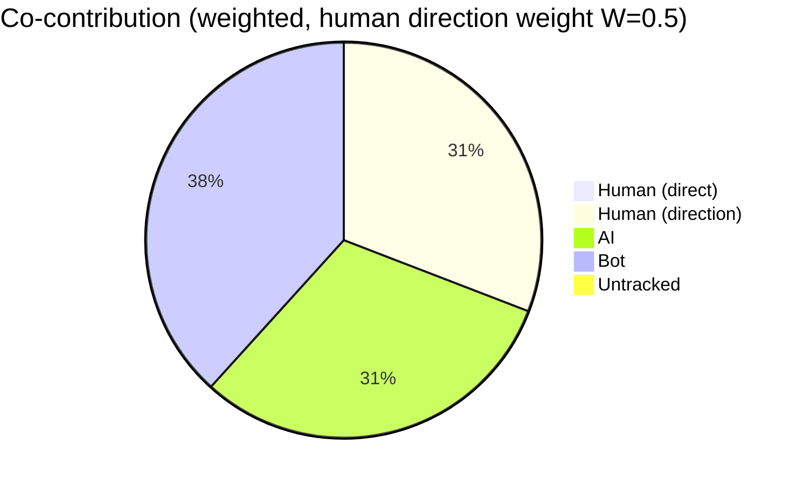
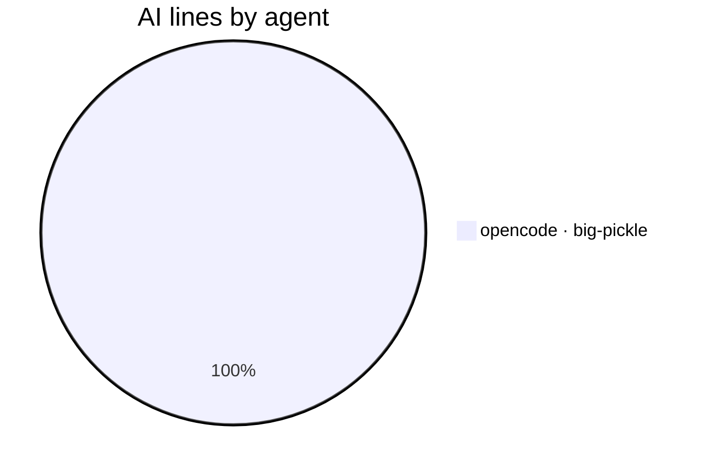
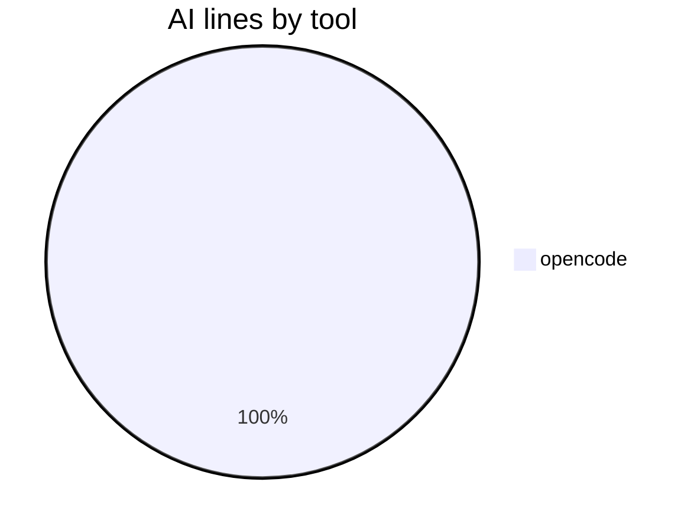
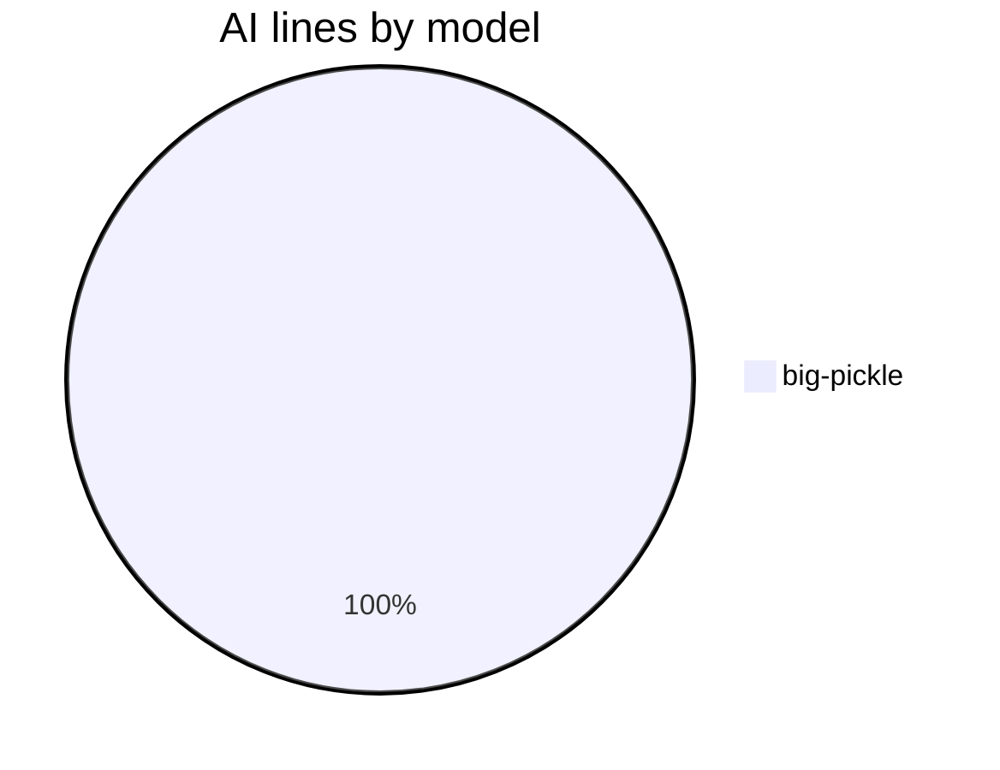

# AI Authorship Report

This file shows which AI coding agent (or human) wrote the code in each commit,
using the [git-ai](https://usegitai.com) attribution notes attached to every
commit. It is regenerated automatically by a GitHub Actions workflow on every
push to `main`.

## Summary

- Commits analyzed: **50** (last 50)
- Total lines added: **4733**
- **AI-generated:** 2921 lines (61.7%)
- **Human:** 0 lines (0.0%)
- **Bot:** 1812 lines (38.3%)
- **Untracked:** 0 lines (0.0%)
- **Human-directed AI:** 2921 lines (weighted credit: 1460 lines at W=0.5)
- **Agent-suggested ideas:** 0 AI lines (0.0% of AI; idea weight 0.3) — credit to human: 1460 lines; credit to agent: 0 lines
- **Co-authored commits (human + AI lines):** 0
- **Agents:** opencode · big-pickle (2921 lines)

## Composition










> **Legend:** `opencode · big-pickle` = agent and the LLM model that generated
> the lines (model is recorded when git-ai can resolve it from the agent's
> session data). `bot` = committed by an automated account (`github-actions[bot]`
> and other `[bot]` accounts, e.g. the workflow regenerating this report) — known
> authorship, not attributed through git-ai. `untracked` = lines with no
> attribution data — written before git-ai was set up or made in the github.com
> web UI (cannot be retroactively attributed). `human` = written directly by a
> human and recorded via `git-ai checkpoint human` or the git-ai extension.
> `Human (direct)` = human-written lines; `Human (direction)` = the credited
> share of AI lines from sessions whose human driver git-ai recorded (weight
> `W` = `REPORT_HUMAN_DIRECTION_WEIGHT`, default 0.5); `Agent (idea)` = lines
> implementing an idea the agent itself suggested earlier (via `Idea-By: agent`
> commit trailer), credited to the agent rather than the human who requested
> it (weight `I` = `REPORT_IDEA_WEIGHT`, default 0.3). `AI` = the AI lines not
> credited to the human (including autonomous AI with no recorded driver). `A` in
> the per-commit table marks a commit whose idea the agent originated; `✓` marks
> a co-authored commit (contains both human-written and AI lines). These are
> line-count percentages, not commit counts. The composition pie excludes the
> report's own `bot` commits by default; set `REPORT_SHOW_BOT_CHART=1` to
> include them, or `REPORT_SHOW_DIRECTION=0` for a strict AI/Human/Untracked
> line-count pie. The "AI lines by tool" and "AI lines by model" pies break
> down the AI attribution by the agent tool and LLM model that produced the
> lines. "Human lines by contributor" shows human-written lines broken down by
> the commit author who recorded them (via `git-ai checkpoint human`).

## Per-commit breakdown

| Commit | Date | Message | Lines | AI | Human | Co | Idea | Agent(s) |
| --- | --- | --- | --- | --- | --- | --- | --- | --- |
| 28155af | 2026-08-16 | fix: clarify human-directed AI text to show weighted credit matching pie chart | 1 | 100% | 0% |  |  | opencode · big-pickle |
| 274a33f | 2026-08-17 | docs: regenerate AI authorship report | 90 | 0% | 0% |  |  | bot |
| 6d609e2 | 2026-08-16 | feat: add Human lines by contributor pie to the composition section | 63 | 100% | 0% |  |  | opencode · big-pickle |
| 3910014 | 2026-08-17 | docs: regenerate AI authorship report | 123 | 0% | 0% |  |  | bot |
| fbb8ab7 | 2026-08-16 | docs: add workflows.md with mixed-commit guide, update README env-var table | 155 | 100% | 0% |  |  | opencode · big-pickle |
| 9a99560 | 2026-08-17 | docs: regenerate AI authorship report | 96 | 0% | 0% |  |  | bot |
| cf52f15 | 2026-08-16 | feat: tool/model breakdown pies, agent-idea provenance (Idea-By trailer), JSON schema v4 | 578 | 100% | 0% |  |  | opencode · big-pickle |
| 2ea42ab | 2026-08-16 | docs: regenerate AI authorship report | 81 | 0% | 0% |  |  | bot |
| 8cb6742 | 2026-08-16 | feat: weighted co-contribution view — human-direction credit (REPORT_HUMAN_DIRECTION_WEIGHT) + co-authored commit marker; JSON schema v3 | 398 | 100% | 0% |  |  | opencode · big-pickle |
| c593e3f | 2026-08-16 | docs: regenerate AI authorship report | 95 | 0% | 0% |  |  | bot |
| 6a7b53d | 2026-08-16 | fix: copy-in workflow template now commits AI-AUTHORSHIP.json alongside the .md (mirrors ai-authorship's own workflow) | 5 | 100% | 0% |  |  | opencode · big-pickle |
| 48265cc | 2026-08-16 | docs: regenerate AI authorship report | 95 | 0% | 0% |  |  | bot |
| 6f78064 | 2026-08-16 | fix: sync-consumers should copy the copy-in workflow template, not ai-authorship's live workflow | 4 | 100% | 0% |  |  | opencode · big-pickle |
| 21ab4d2 | 2026-08-16 | docs: regenerate AI authorship report | 84 | 0% | 0% |  |  | bot |
| 9548fe3 | 2026-08-16 | feat: REPORT_SHOW_BOT_CHART toggle for composition pie; default hides report's own bot commits | 88 | 100% | 0% |  |  | opencode · big-pickle |
| 2150bb8 | 2026-08-16 | docs: regenerate AI authorship report | 71 | 0% | 0% |  |  | bot |
| 1436e0e | 2026-08-16 | feat: label CI bot commits as a distinct 'bot' category in report (not untracked) | 180 | 100% | 0% |  |  | opencode · big-pickle |
| 03c0e9e | 2026-08-16 | docs: regenerate AI authorship report | 94 | 0% | 0% |  |  | bot |
| c8a71b4 | 2026-08-16 | docs: add 'let your coding agent install it' as a Quick Start install path | 29 | 100% | 0% |  |  | opencode · big-pickle |
| f505760 | 2026-08-16 | docs: regenerate AI authorship report | 99 | 0% | 0% |  |  | bot |
| 36f699a | 2026-08-16 | feat: add consumer sync helper + pinned auto-update workflow variant + template-sync docs | 213 | 100% | 0% |  |  | opencode · big-pickle |
| 2c796a6 | 2026-08-16 | docs: regenerate AI authorship report | 69 | 0% | 0% |  |  | bot |
| 9c8954c | 2026-08-16 | feat: add per-agent breakdown pie chart to report composition | 59 | 100% | 0% |  |  | opencode · big-pickle |
| a3b4f73 | 2026-08-16 | docs: regenerate AI authorship report | 69 | 0% | 0% |  |  | bot |
| 4fd1f6d | 2026-08-16 | feat: add mermaid composition pie chart to AI authorship report | 58 | 100% | 0% |  |  | opencode · big-pickle |
| dc219ff | 2026-08-16 | docs: regenerate AI authorship report | 151 | 0% | 0% |  |  | bot |
| d95e7d3 | 2026-08-16 | docs: regenerate AI authorship report with JSON twin | 823 | 100% | 0% |  |  | opencode · big-pickle |
| 4d898b8 | 2026-08-16 | feat: emit machine-readable AI-AUTHORSHIP.json; document manual-policy case study and human-review future idea | 115 | 100% | 0% |  |  | opencode · big-pickle |
| 90aece2 | 2026-08-16 | docs: regenerate AI authorship report | 51 | 0% | 0% |  |  | bot |
| 6bb37ac | 2026-08-15 | docs: list Local models via OpenCode as first out-of-the-box option | 2 | 100% | 0% |  |  | opencode · big-pickle |
| bc38201 | 2026-08-16 | docs: regenerate AI authorship report | 53 | 0% | 0% |  |  | bot |
| 6cdd963 | 2026-08-15 | docs: promote LM Studio to Agent Support (tested & verified), keep Currently Testing as suggestion channel | 35 | 100% | 0% |  |  | opencode · big-pickle |
| c7b38d5 | 2026-08-16 | docs: regenerate AI authorship report | 52 | 0% | 0% |  |  | bot |
| 3db2752 | 2026-08-15 | docs: note game-of-life local-model (LM Studio) proof as 8th attribution source | 7 | 100% | 0% |  |  | opencode · big-pickle |
| 22f81a9 | 2026-08-15 | docs: regenerate AI authorship report | 54 | 0% | 0% |  |  | bot |
| 2f5d298 | 2026-08-15 | docs: mark local models (LM Studio + qwen2.5-7b-instruct) as verified live, document qwen2.5-coder tool-call failure | 17 | 100% | 0% |  |  | opencode · big-pickle |
| ade987c | 2026-08-15 | docs: regenerate AI authorship report | 54 | 0% | 0% |  |  | bot |
| 4a6e461 | 2026-08-14 | docs: add community tagline callout and Currently Testing section with LM Studio self-hosted setup | 26 | 100% | 0% |  |  | opencode · big-pickle |
| 37c930a | 2026-08-15 | docs: regenerate AI authorship report | 57 | 0% | 0% |  |  | bot |
| f9fd6f2 | 2026-08-14 | docs: strengthen AI code attribution keywords in headings and intro for indexing | 6 | 100% | 0% |  |  | opencode · big-pickle |
| dbdba5c | 2026-08-15 | docs: regenerate AI authorship report | 62 | 0% | 0% |  |  | bot |
| a211e22 | 2026-08-14 | docs: bundle native agents into one Quick Start section, trim duplicate notes and requirements | 26 | 100% | 0% |  |  | opencode · big-pickle |
| 0f995ea | 2026-08-15 | docs: regenerate AI authorship report | 52 | 0% | 0% |  |  | bot |
| 487cb82 | 2026-08-14 | docs: consolidate native-hook agents into one row in Agent Support table | 1 | 100% | 0% |  |  | opencode · big-pickle |
| 382ae1e | 2026-08-15 | docs: regenerate AI authorship report | 53 | 0% | 0% |  |  | bot |
| 9c03147 | 2026-08-14 | docs: split Agent Support into tested vs untested checkpoint presets | 20 | 100% | 0% |  |  | opencode · big-pickle |
| a02d433 | 2026-08-15 | docs: regenerate AI authorship report | 55 | 0% | 0% |  |  | bot |
| 118047e | 2026-08-14 | docs: fix integration count, drop Windsurf/Continue refs, add hobbyist note and free-tier asterisks | 11 | 100% | 0% |  |  | opencode · big-pickle |
| 3be921f | 2026-08-15 | docs: regenerate AI authorship report | 52 | 0% | 0% |  |  | bot |
| 5582168 | 2026-08-14 | chore: gitignore private competition reference notes | 1 | 100% | 0% |  |  | opencode · big-pickle |

## Raw git-ai log (last 25 commits)

<details>
<summary>Show raw attribution detail</summary>

```text
commit 28155af0333e54c40f73d56f9669bb0d7cdb9951 (HEAD -> main, origin/main)
Author: CaliMark <mreed@needpc.net>
Date:   2026-08-16T21:56:56-07:00

    fix: clarify human-directed AI text to show weighted credit matching pie chart

    Git AI stats:
      you  ░░░░░░░░░░░░░░░░░░░░░░░░░░░░░░░░░░░░░░░░ ai
           0%                                  100%

    Authorship note:
      scripts/authorship-report.sh
        s_52d0732141ad88::t_5a868467ccfebd 430
      ---
      {
        "schema_version": "authorship/3.0.0",
        "git_ai_version": "1.6.22",
        "base_commit_sha": "28155af0333e54c40f73d56f9669bb0d7cdb9951",
        "prompts": {},
        "sessions": {
          "s_52d0732141ad88": {
            "agent_id": {
              "tool": "opencode",
              "id": "ses_008f7fcbaffeQRUMaWQo3qCxm4",
              "model": "big-pickle"
            },
            "human_author": "CaliMark <mreed@needpc.net>"
          }
        }
      }

commit 274a33f41bdc616777098fa5fc3b845d5ab94a5d
Author: github-actions[bot] <41898282+github-actions[bot]@users.noreply.github.com>
Date:   2026-08-17T01:57:18Z

    docs: regenerate AI authorship report

    Git AI stats:
      you  ········································ ai
           0%           untracked 100%            0%

    Authorship note:
      (none)

commit 6d609e2f6cfbe8f78bafcb1c9071eca8c937eabe
Author: CaliMark <mreed@needpc.net>
Date:   2026-08-16T18:56:39-07:00

    feat: add Human lines by contributor pie to the composition section

    Git AI stats:
      you  ░░░░░░░░░░░░░░░░░░░░░░░░░░░░░░░░░░░░░░░░ ai
           0%                                  100%

    Authorship note:
      scripts/authorship-report.sh
        s_52d0732141ad88::t_9118070580aabc 260-266,363,445-446,469-470
      AI-AUTHORSHIP.json
        s_52d0732141ad88::t_8de899fa25e6cc 3,7,9,12-13,38-59,164
      AI-AUTHORSHIP.md
        s_52d0732141ad88::t_8de899fa25e6cc 11-12,14,46-47,70-71,77,82,134-147
      ---
      {
        "schema_version": "authorship/3.0.0",
        "git_ai_version": "1.6.22",
        "base_commit_sha": "6d609e2f6cfbe8f78bafcb1c9071eca8c937eabe",
        "prompts": {},
        "sessions": {
          "s_52d0732141ad88": {
            "agent_id": {
              "tool": "opencode",
              "id": "ses_008f7fcbaffeQRUMaWQo3qCxm4",
              "model": "big-pickle"
            },
            "human_author": "CaliMark <mreed@needpc.net>"
          }
        }
      }

commit 3910014af4074890bb7ad80a17fccf13efe2055a
Author: github-actions[bot] <41898282+github-actions[bot]@users.noreply.github.com>
Date:   2026-08-17T01:27:10Z

    docs: regenerate AI authorship report

    Git AI stats:
      you  ········································ ai
           0%           untracked 100%            0%

    Authorship note:
      (none)

commit fbb8ab702a3aa8afcc2a6f7e961f5058182cc6d5
Author: CaliMark <mreed@needpc.net>
Date:   2026-08-16T18:25:22-07:00

    docs: add workflows.md with mixed-commit guide, update README env-var table

    Git AI stats:
      you  ░░░░░░░░░░░░░░░░░░░░░░░░░░░░░░░░░░░░░░░░ ai
           0%                                  100%

    Authorship note:
      docs/workflows.md
        s_52d0732141ad88::t_8f8b30649e0de8 1-69,71,73-78,80,82-85,87-89,91,93,95-115,118,121,123,125,127-131,134-136,138-139,141,143,145-146,148-150,152-153,155-156,158,160,162-164,166-176,178-179
      README.md
        s_52d0732141ad88::t_e6f822e6c75dbe 451-455
      ---
      {
        "schema_version": "authorship/3.0.0",
        "git_ai_version": "1.6.22",
        "base_commit_sha": "fbb8ab702a3aa8afcc2a6f7e961f5058182cc6d5",
        "prompts": {},
        "sessions": {
          "s_52d0732141ad88": {
            "agent_id": {
              "tool": "opencode",
              "id": "ses_008f7fcbaffeQRUMaWQo3qCxm4",
              "model": "big-pickle"
            },
            "human_author": "CaliMark <mreed@needpc.net>"
          }
        }
      }

commit 9a995600de079085a391c6c829bc2b5e95d326c2
Author: github-actions[bot] <41898282+github-actions[bot]@users.noreply.github.com>
Date:   2026-08-17T01:10:43Z

    docs: regenerate AI authorship report

    Git AI stats:
      you  ········································ ai
           0%           untracked 100%            0%

    Authorship note:
      (none)

commit cf52f15169a39e6998d8fd3b9662e410e6bb526a
Author: CaliMark <mreed@needpc.net>
Date:   2026-08-16T18:10:12-07:00

    feat: tool/model breakdown pies, agent-idea provenance (Idea-By trailer), JSON schema v4

    Git AI stats:
      you  ░░░░░░░░░░░░░░░░░░░░░░░░░░░░░░░░░░░░░░░░ ai
           0%                                  100%

    Authorship note:
      workflow/authorship-report.yml
        s_52d0732141ad88::t_ecb8d277c8be77 37-42
      AI-AUTHORSHIP.json
        s_52d0732141ad88::t_6905c216abb5aa 2-3,7,9,12-13,21-25,29-34,38-59,64,73,80-85,101,106-108,123,130-135,151,156-158,173,180-185,201,206-208,223,230-235,251,256-258,273,280-285,301,306-308,323,330-335,351,356-358,373,380-385,401,406-408,423,430-435,451,456-458,473,480-485,501,506-508,523,530-535,551,558-563,579,584-586,601,608-613,629,634-636,651,658-663,679,684-686,701,708-713,729,734-736,751,758-763,779,784-786,801,808-813,829,834-836,851,858-863,879,884-886,901,908-913,929,934-936,951,958-963,979,984-986,1001,1008-1013,1029,1034-1036,1051,1058-1063,1079,1084-1086,1101,1108-1113,1129,1134-1136,1151,1158-1163,1179,1186-1191,1207,1212-1214,1229,1236-1241,1257,1262-1264,1279,1286-1291
      scripts/authorship-report.sh
        s_52d0732141ad88::t_ecb8d277c8be77 80-97,99,107-108,110-111,122,188-224,226-228,242-244,246,249,251-258,261-262,265,270-272,307,309-319,323,338,345-346,349,353-356,364-367,370,372-386,423,431-435,447-459,463-464,487,506-510,512-514
      .github/workflows/authorship-report.yml
        s_52d0732141ad88::t_ecb8d277c8be77 38-42
      AI-AUTHORSHIP.md
        s_52d0732141ad88::t_6905c216abb5aa 11-12,14,17,36-45,56-68,72-123,131-144
      workflow/authorship-report-pinned.yml
        s_52d0732141ad88::t_ecb8d277c8be77 48-53
      ---
      {
        "schema_version": "authorship/3.0.0",
        "git_ai_version": "1.6.22",
        "base_commit_sha": "cf52f15169a39e6998d8fd3b9662e410e6bb526a",
        "prompts": {},
        "sessions": {
          "s_52d0732141ad88": {
            "agent_id": {
              "tool": "opencode",
              "id": "ses_008f7fcbaffeQRUMaWQo3qCxm4",
              "model": "big-pickle"
            },
            "human_author": "CaliMark <mreed@needpc.net>"
          }
        }
      }

commit 2ea42abf5b5e496397018a26b9685dd2f4d9a474
Author: github-actions[bot] <41898282+github-actions[bot]@users.noreply.github.com>
Date:   2026-08-16T20:46:27Z

    docs: regenerate AI authorship report

    Git AI stats:
      you  ········································ ai
           0%           untracked 100%            0%

    Authorship note:
      (none)

commit 8cb6742cb2b8c0fc688812f0738eccd4289281cd
Author: CaliMark <mreed@needpc.net>
Date:   2026-08-16T13:45:42-07:00

    feat: weighted co-contribution view — human-direction credit (REPORT_HUMAN_DIRECTION_WEIGHT) + co-authored commit marker; JSON schema v3

    Git AI stats:
      you  ░░░░░░░░░░░░░░░░░░░░░░░░░░░░░░░░░░░░░░░░ ai
           0%                                  100%

    Authorship note:
      AI-AUTHORSHIP.json
        s_52d0732141ad88::t_860fc178ee1194 2-3,7,9,12-13,16-21,27-45,57-59,78-80,97-99,118-120,137-139,158-160,177-179,198-200,217-219,238-240,257-259,278-280,297-299,318-320,337-339,358-360,377-379,398-400,419-421,438-440,459-461,478-480,499-501,518-520,539-541,558-560,579-581,598-600,619-621,638-640,659-661,678-680,699-701,718-720,739-741,758-760,779-781,798-800,819-821,838-840,859-861,878-880,899-901,920-922,939-941,960-962,979-981,1000-1002,1019-1021
      scripts/authorship-report.sh
        s_52d0732141ad88::t_79ceea3c2a8283 38-41,43,45,49,58,67-79,81,105-146,167-175,237-238,240-242,245,255-257,269-285,317-318,334-343,347-348,371,385-390
      .github/workflows/authorship-report.yml
        s_52d0732141ad88::t_79ceea3c2a8283 33-37
      AI-AUTHORSHIP.md
        s_52d0732141ad88::t_860fc178ee1194 11-12,14,16-17,23-26,42-51,55-106,114-127
      workflow/authorship-report-pinned.yml
        s_52d0732141ad88::t_79ceea3c2a8283 43-47
      workflow/authorship-report.yml
        s_52d0732141ad88::t_79ceea3c2a8283 32-36
      ---
      {
        "schema_version": "authorship/3.0.0",
        "git_ai_version": "1.6.22",
        "base_commit_sha": "8cb6742cb2b8c0fc688812f0738eccd4289281cd",
        "prompts": {},
        "sessions": {
          "s_52d0732141ad88": {
            "agent_id": {
              "tool": "opencode",
              "id": "ses_008f7fcbaffeQRUMaWQo3qCxm4",
              "model": "big-pickle"
            },
            "human_author": "CaliMark <mreed@needpc.net>"
          }
        }
      }

commit c593e3f8e76108a3a3d39710651f4a53416f1cf4
Author: github-actions[bot] <41898282+github-actions[bot]@users.noreply.github.com>
Date:   2026-08-16T19:59:46Z

    docs: regenerate AI authorship report

    Git AI stats:
      you  ········································ ai
           0%           untracked 100%            0%

    Authorship note:
      (none)

commit 6a7b53d18fcbdb923e4a1e5646332fff003d78dc
Author: CaliMark <mreed@needpc.net>
Date:   2026-08-16T12:59:03-07:00

    fix: copy-in workflow template now commits AI-AUTHORSHIP.json alongside the .md (mirrors ai-authorship's own workflow)

    Git AI stats:
      you  ░░░░░░░░░░░░░░░░░░░░░░░░░░░░░░░░░░░░░░░░ ai
           0%                                  100%

    Authorship note:
      workflow/authorship-report.yml
        s_52d0732141ad88::t_6150215fe02826 60,69-70,72,77
      ---
      {
        "schema_version": "authorship/3.0.0",
        "git_ai_version": "1.6.22",
        "base_commit_sha": "6a7b53d18fcbdb923e4a1e5646332fff003d78dc",
        "prompts": {},
        "sessions": {
          "s_52d0732141ad88": {
            "agent_id": {
              "tool": "opencode",
              "id": "ses_008f7fcbaffeQRUMaWQo3qCxm4",
              "model": "big-pickle"
            },
            "human_author": "CaliMark <mreed@needpc.net>"
          }
        }
      }

commit 48265cc56a9addad3a4e630a544d6590997e51c5
Author: github-actions[bot] <41898282+github-actions[bot]@users.noreply.github.com>
Date:   2026-08-16T19:44:28Z

    docs: regenerate AI authorship report

    Git AI stats:
      you  ········································ ai
           0%           untracked 100%            0%

    Authorship note:
      (none)

commit 6f78064fb925d951509582b34018d1685debcef4
Author: CaliMark <mreed@needpc.net>
Date:   2026-08-16T12:43:57-07:00

    fix: sync-consumers should copy the copy-in workflow template, not ai-authorship's live workflow

    Git AI stats:
      you  ░░░░░░░░░░░░░░░░░░░░░░░░░░░░░░░░░░░░░░░░ ai
           0%                                  100%

    Authorship note:
      scripts/sync-consumers.sh
        s_52d0732141ad88::t_0b06e974f57d15 30-33
      ---
      {
        "schema_version": "authorship/3.0.0",
        "git_ai_version": "1.6.22",
        "base_commit_sha": "6f78064fb925d951509582b34018d1685debcef4",
        "prompts": {},
        "sessions": {
          "s_52d0732141ad88": {
            "agent_id": {
              "tool": "opencode",
              "id": "ses_008f7fcbaffeQRUMaWQo3qCxm4",
              "model": "big-pickle"
            },
            "human_author": "CaliMark <mreed@needpc.net>"
          }
        }
      }

commit 21ab4d2358dac8486a419f941efd58fef20db0d8
Author: github-actions[bot] <41898282+github-actions[bot]@users.noreply.github.com>
Date:   2026-08-16T19:42:54Z

    docs: regenerate AI authorship report

    Git AI stats:
      you  ········································ ai
           0%           untracked 100%            0%

    Authorship note:
      (none)

commit 9548fe34d189691cca4633fcd81290d3afedd0b2
Author: CaliMark <mreed@needpc.net>
Date:   2026-08-16T12:42:25-07:00

    feat: REPORT_SHOW_BOT_CHART toggle for composition pie; default hides report's own bot commits

    Git AI stats:
      you  ░░░░░░░░░░░░░░░░░░░░░░░░░░░░░░░░░░░░░░░░ ai
           0%                                  100%

    Authorship note:
      workflow/authorship-report.yml
        s_52d0732141ad88::t_dfd662bbf9fad8 29-31
      AI-AUTHORSHIP.md
        s_52d0732141ad88::t_6ccca90ca040bf 11-12,14,16,22,24,30,41-43,49,106-119
      .github/workflows/authorship-report.yml
        s_52d0732141ad88::t_a68b6f350be7bd 29-32
      scripts/authorship-report.sh
        s_52d0732141ad88::t_cded9381b68803 44,54-59
        s_52d0732141ad88::t_20469963f01b64 193-210
        s_52d0732141ad88::t_59b28b66f94ab7 230,242-244
        s_30f00a1884ee3d::t_2656ed9817f2e7 60
      workflow/authorship-report-pinned.yml
        s_52d0732141ad88::t_be64a9135e6de7 40-42
      AI-AUTHORSHIP.json
        s_52d0732141ad88::t_6ccca90ca040bf 3,7-9,12-13,17,21-36
      ---
      {
        "schema_version": "authorship/3.0.0",
        "git_ai_version": "1.6.22",
        "base_commit_sha": "9548fe34d189691cca4633fcd81290d3afedd0b2",
        "prompts": {},
        "sessions": {
          "s_30f00a1884ee3d": {
            "agent_id": {
              "tool": "opencode",
              "id": "ses_0251ccc8bffeRD38fJ4fosd3c2",
              "model": "big-pickle"
            },
            "human_author": "CaliMark <mreed@needpc.net>"
          },
          "s_52d0732141ad88": {
            "agent_id": {
              "tool": "opencode",
              "id": "ses_008f7fcbaffeQRUMaWQo3qCxm4",
              "model": "big-pickle"
            },
            "human_author": "CaliMark <mreed@needpc.net>"
          }
        }
      }

commit 2150bb86cc8ab4b8f66d5d967f7d7f4113dd2f9f
Author: github-actions[bot] <41898282+github-actions[bot]@users.noreply.github.com>
Date:   2026-08-16T19:05:34Z

    docs: regenerate AI authorship report

    Git AI stats:
      you  ········································ ai
           0%           untracked 100%            0%

    Authorship note:
      (none)

commit 1436e0ea33117948a7262c4a145b71d17b2c2995
Author: CaliMark <mreed@needpc.net>
Date:   2026-08-16T12:05:02-07:00

    feat: label CI bot commits as a distinct 'bot' category in report (not untracked)

    Git AI stats:
      you  ░░░░░░░░░░░░░░░░░░░░░░░░░░░░░░░░░░░░░░░░ ai
           0%                                  100%

    Authorship note:
      AI-AUTHORSHIP.md
        s_52d0732141ad88::t_9d8f25f6083ccf 11,14-15,21,24-25,35-40,47,49,51,53,55,58,60,62,64,66,68,70,72,74,76,78,80,83,85,87,89,91,93,104-117
      AI-AUTHORSHIP.json
        s_52d0732141ad88::t_9d8f25f6083ccf 2-3,7,12-15,21-36,40,58,67,74,92,101,108,126,135,142,160,169,176,194,212,221,228,246,255,262,280,289,296,314,323,330,348,357,364,382,391,398,416,425,432,450,459,466,484,493,500,518,527,534,552,561,568,586,595,602,620,638,647,654,672,681,688,706,715,722,740,749,756,774,783,790,808,817,824,842,860
      scripts/authorship-report.sh
        s_52d0732141ad88::t_79cab1c6273893 166
        s_52d0732141ad88::t_bd370fb89b77a5 54,62-63,65,73-76,81-87,90-91,93,95-96
        s_52d0732141ad88::t_501298cd551f98 130-131,142-143
        s_52d0732141ad88::t_ec6fd89d26e247 198,205,208,216-221
        s_52d0732141ad88::t_d0fdc653555f0b 250,260-261
      ---
      {
        "schema_version": "authorship/3.0.0",
        "git_ai_version": "1.6.22",
        "base_commit_sha": "1436e0ea33117948a7262c4a145b71d17b2c2995",
        "prompts": {},
        "sessions": {
          "s_52d0732141ad88": {
            "agent_id": {
              "tool": "opencode",
              "id": "ses_008f7fcbaffeQRUMaWQo3qCxm4",
              "model": "big-pickle"
            },
            "human_author": "CaliMark <mreed@needpc.net>"
          }
        }
      }

commit 03c0e9e85cdd89646c2106386b372bd3fc83b7fe
Author: github-actions[bot] <41898282+github-actions[bot]@users.noreply.github.com>
Date:   2026-08-16T18:48:57Z

    docs: regenerate AI authorship report

    Git AI stats:
      you  ········································ ai
           0%           untracked 100%            0%

    Authorship note:
      (none)

commit c8a71b4bb5d2b50c5d413b5b79fcf2e7230396e5
Author: CaliMark <mreed@needpc.net>
Date:   2026-08-16T11:48:18-07:00

    docs: add 'let your coding agent install it' as a Quick Start install path

    Git AI stats:
      you  ░░░░░░░░░░░░░░░░░░░░░░░░░░░░░░░░░░░░░░░░ ai
           0%                                  100%

    Authorship note:
      README.md
        s_52d0732141ad88::t_66856e8d1da714 39
        s_52d0732141ad88::t_b15a2b2eae995c 166-193
      ---
      {
        "schema_version": "authorship/3.0.0",
        "git_ai_version": "1.6.22",
        "base_commit_sha": "c8a71b4bb5d2b50c5d413b5b79fcf2e7230396e5",
        "prompts": {},
        "sessions": {
          "s_52d0732141ad88": {
            "agent_id": {
              "tool": "opencode",
              "id": "ses_008f7fcbaffeQRUMaWQo3qCxm4",
              "model": "big-pickle"
            },
            "human_author": "CaliMark <mreed@needpc.net>"
          }
        }
      }

commit f5057604ae0a6af6d6b8cfb0b2089252b26b4295
Author: github-actions[bot] <41898282+github-actions[bot]@users.noreply.github.com>
Date:   2026-08-16T18:37:57Z

    docs: regenerate AI authorship report

    Git AI stats:
      you  ········································ ai
           0%           untracked 100%            0%

    Authorship note:
      (none)

commit 36f699a4fe9d00168b1d7276cf0830e669a7e9a4 (tag: v1.1.0)
Author: CaliMark <mreed@needpc.net>
Date:   2026-08-16T11:37:17-07:00

    feat: add consumer sync helper + pinned auto-update workflow variant + template-sync docs

    Git AI stats:
      you  ░░░░░░░░░░░░░░░░░░░░░░░░░░░░░░░░░░░░░░░░ ai
           0%                                  100%

    Authorship note:
      scripts/sync-consumers.sh
        s_52d0732141ad88::t_f41cbe580b5fa2 1-83
      workflow/authorship-report-pinned.yml
        s_52d0732141ad88::t_4eaee8647ecb77 1-94
      README.md
        s_52d0732141ad88::t_605adb97b5019a 49
      docs/workflows.md
        s_52d0732141ad88::t_665b517694c377 153-187
      ---
      {
        "schema_version": "authorship/3.0.0",
        "git_ai_version": "1.6.22",
        "base_commit_sha": "36f699a4fe9d00168b1d7276cf0830e669a7e9a4",
        "prompts": {},
        "sessions": {
          "s_52d0732141ad88": {
            "agent_id": {
              "tool": "opencode",
              "id": "ses_008f7fcbaffeQRUMaWQo3qCxm4",
              "model": "big-pickle"
            },
            "human_author": "CaliMark <mreed@needpc.net>"
          }
        }
      }

commit 2c796a68fd1182da349f4d0442066985fc96d191
Author: github-actions[bot] <41898282+github-actions[bot]@users.noreply.github.com>
Date:   2026-08-16T18:16:45Z

    docs: regenerate AI authorship report

    Git AI stats:
      you  ········································ ai
           0%           untracked 100%            0%

    Authorship note:
      (none)

commit 9c8954c57c0a496cef7114cc864947fdd402b02e
Author: CaliMark <mreed@needpc.net>
Date:   2026-08-16T11:16:09-07:00

    feat: add per-agent breakdown pie chart to report composition

    Git AI stats:
      you  ░░░░░░░░░░░░░░░░░░░░░░░░░░░░░░░░░░░░░░░░ ai
           0%                                  100%

    Authorship note:
      AI-AUTHORSHIP.json
        s_52d0732141ad88::t_7ac3d8c7bd5b03 19
        s_52d0732141ad88::t_7e984148355d5c 3,7-9,12-13,20-33
      AI-AUTHORSHIP.md
        s_52d0732141ad88::t_7ac3d8c7bd5b03 24-25
        s_52d0732141ad88::t_f5762da4b7f2f8 11-12,14-15,21,23,26-28,43,100-113
      scripts/authorship-report.sh
        s_52d0732141ad88::t_cb805b42a40e18 194-195
        s_52d0732141ad88::t_80d85ab8739085 105-114
      ---
      {
        "schema_version": "authorship/3.0.0",
        "git_ai_version": "1.6.22",
        "base_commit_sha": "9c8954c57c0a496cef7114cc864947fdd402b02e",
        "prompts": {},
        "sessions": {
          "s_52d0732141ad88": {
            "agent_id": {
              "tool": "opencode",
              "id": "ses_008f7fcbaffeQRUMaWQo3qCxm4",
              "model": "big-pickle"
            },
            "human_author": "CaliMark <mreed@needpc.net>"
          }
        }
      }

commit a3b4f7303b08edf47efec2a5b6b5a8966f451d23
Author: github-actions[bot] <41898282+github-actions[bot]@users.noreply.github.com>
Date:   2026-08-16T17:56:04Z

    docs: regenerate AI authorship report

    Git AI stats:
      you  ········································ ai
           0%           untracked 100%            0%

    Authorship note:
      (none)

commit 4fd1f6d60fbe96887218a565490bdee14cad85b8
Author: CaliMark <mreed@needpc.net>
Date:   2026-08-16T10:55:29-07:00

    feat: add mermaid composition pie chart to AI authorship report

    Git AI stats:
      you  ░░░░░░░░░░░░░░░░░░░░░░░░░░░░░░░░░░░░░░░░ ai
           0%                                  100%

    Authorship note:
      AI-AUTHORSHIP.md
        s_52d0732141ad88::t_31438225eae04f 16
        s_52d0732141ad88::t_38cba88c7213e6 11-12,14-15,17-24,38,95-108
      AI-AUTHORSHIP.json
        s_52d0732141ad88::t_31438225eae04f 20
        s_52d0732141ad88::t_60b1929b9a7697 3,7-9,12-13,21-34
      scripts/authorship-report.sh
        s_52d0732141ad88::t_d3af74efc07e6c 175-183
      ---
      {
        "schema_version": "authorship/3.0.0",
        "git_ai_version": "1.6.22",
        "base_commit_sha": "4fd1f6d60fbe96887218a565490bdee14cad85b8",
        "prompts": {},
        "sessions": {
          "s_52d0732141ad88": {
            "agent_id": {
              "tool": "opencode",
              "id": "ses_008f7fcbaffeQRUMaWQo3qCxm4",
              "model": "big-pickle"
            },
            "human_author": "CaliMark <mreed@needpc.net>"
          }
        }
      }


```
</details>

---

_Generated by [git-ai](https://usegitai.com). See `git ai blame <file>` for
line-level attribution of any file._
