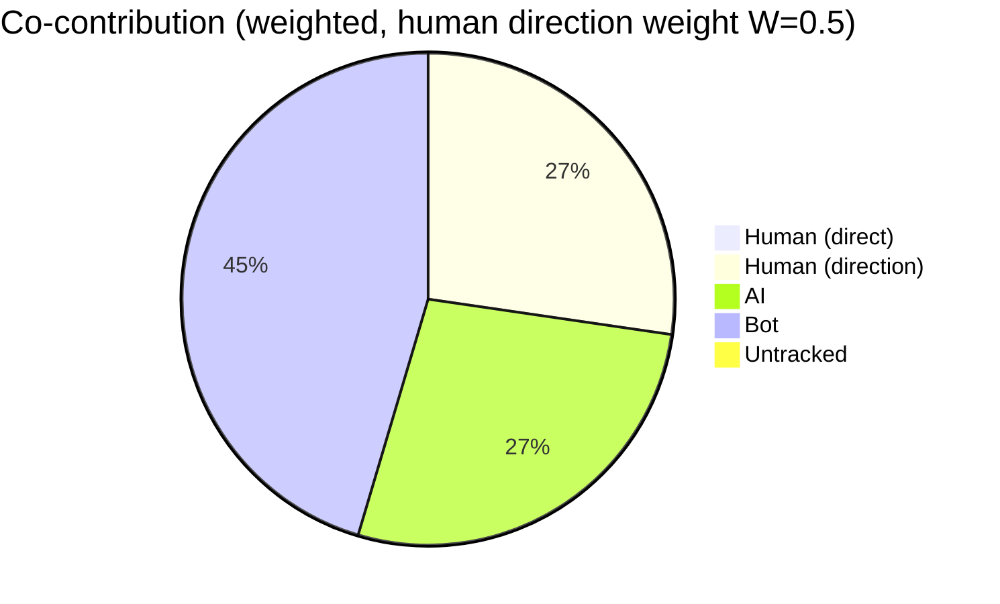
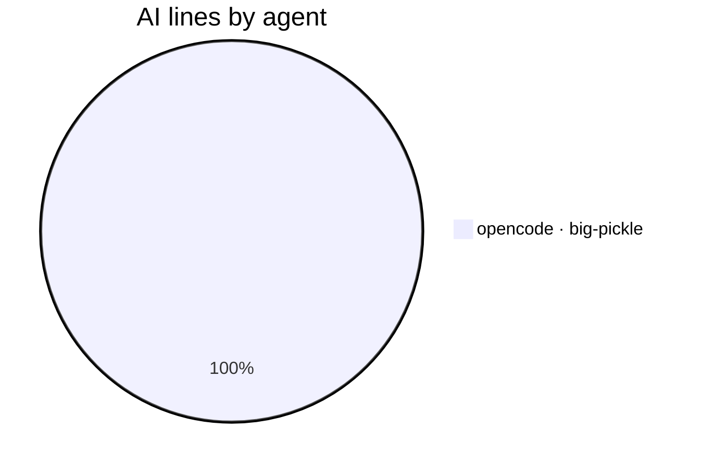
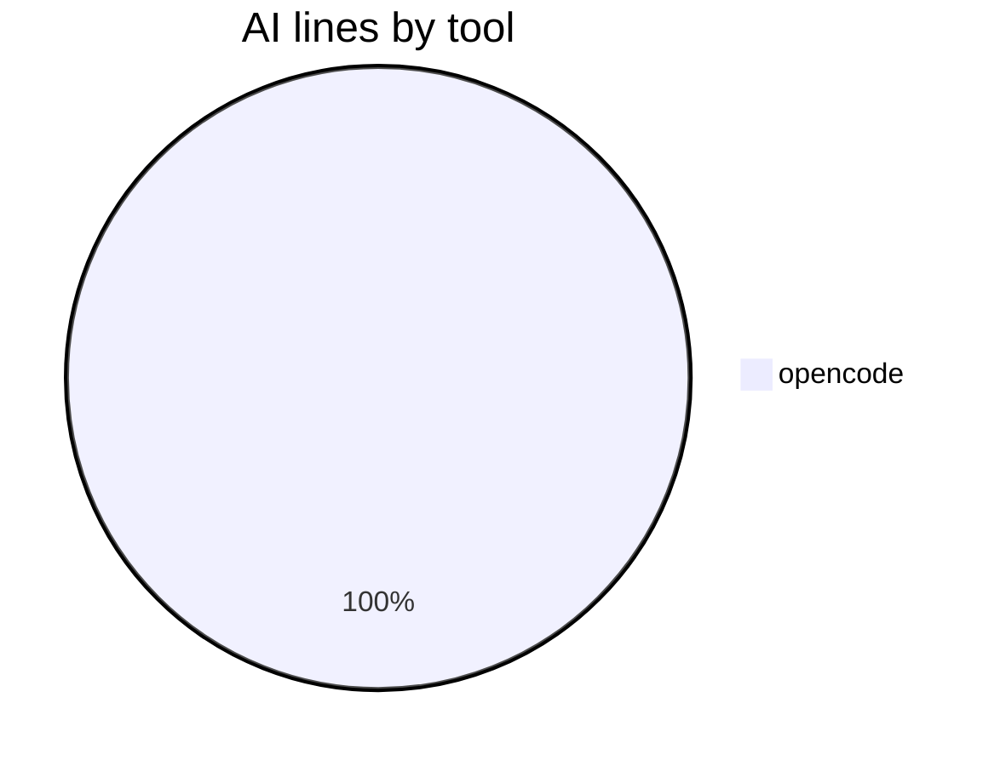
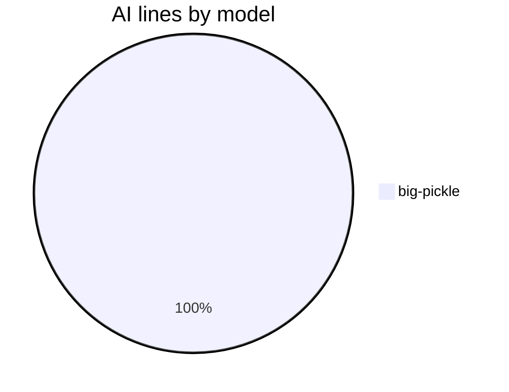

# AI Authorship Report

This file shows which AI coding agent (or human) wrote the code in each commit,
using the [git-ai](https://usegitai.com) attribution notes attached to every
commit. It is regenerated automatically by a GitHub Actions workflow on every
push to `main`.

## Summary

- Commits analyzed: **50** (last 50)
- Total lines added: **5574**
- **AI-generated:** 3043 lines (54.6%)
- **Human:** 0 lines (0.0% of project)
- **Bot:** 2531 lines (45.4%)
- **Untracked:** 0 lines (0.0%)
- **Human-directed AI:** 3043 lines (weighted credit: 1522 lines at W=0.5, 50.0% of project)
- **Agent-suggested ideas:** 0 AI lines (0.0% of AI; idea weight 0.3) — credit to human: 1522 lines; credit to agent: 0 lines
- **Co-authored commits (human + AI lines):** 0
- **Agents:** opencode · big-pickle (3043 lines)

## Composition










> **Legend:** `opencode · big-pickle` = agent and the LLM model that generated
> the lines (model is recorded when git-ai can resolve it from the agent's
> session data). `bot` = committed by an automated account (`github-actions[bot]`
> and other `[bot]` accounts, e.g. the workflow regenerating this report) — known
> authorship, not attributed through git-ai. `untracked` = lines with no
> attribution data — written before git-ai was set up or made in the github.com
> web UI (cannot be retroactively attributed). `human` = written directly by a
> human and recorded via `git-ai checkpoint human` or the git-ai extension.
> `Human (direct)` = human-written lines; `Human (direction)` = the credited
> share of AI lines from sessions whose human driver git-ai recorded (weight
> `W` = `REPORT_HUMAN_DIRECTION_WEIGHT`, default 0.5); `Agent (idea)` = lines
> implementing an idea the agent itself suggested earlier (via `Idea-By: agent`
> commit trailer), credited to the agent rather than the human who requested
> it (weight `I` = `REPORT_IDEA_WEIGHT`, default 0.3). `AI` = the AI lines not
> credited to the human (including autonomous AI with no recorded driver). `A` in
> the per-commit table marks a commit whose idea the agent originated; `✓` marks
> a co-authored commit (contains both human-written and AI lines). These are
> line-count percentages, not commit counts. The composition pie excludes the
> report's own `bot` commits by default; set `REPORT_SHOW_BOT_CHART=1` to
> include them, or `REPORT_SHOW_DIRECTION=0` for a strict AI/Human/Untracked
> line-count pie. The "AI lines by tool" and "AI lines by model" pies break
> down the AI attribution by the agent tool and LLM model that produced the
> lines. "Human lines by contributor" shows human-written lines broken down by
> the commit author who recorded them (via `git-ai checkpoint human`).

## Per-commit breakdown

| Commit | Date | Message | Lines | AI | Human | Co | Idea | Agent(s) |
| --- | --- | --- | --- | --- | --- | --- | --- | --- |
| 531b635 | 2026-08-17 | docs: split LM Studio and Ollama in agent list | 2 | 100% | 0% |  |  | opencode · big-pickle |
| c5c90fa | 2026-08-17 | docs: regenerate AI authorship report | 163 | 0% | 0% |  |  | bot |
| 4134116 | 2026-08-17 | docs: restructure README — quick start at top, LM Studio/Ollama split | 114 | 100% | 0% |  |  | opencode · big-pickle |
| 878ccd8 | 2026-08-17 | docs: regenerate AI authorship report | 132 | 0% | 0% |  |  | bot |
| 8e73951 | 2026-08-17 | chore: move VALUE-PROPOSITION.md to local-only (gitignored) | 1 | 100% | 0% |  |  | opencode · big-pickle |
| feab192 | 2026-08-17 | docs: regenerate AI authorship report | 133 | 0% | 0% |  |  | bot |
| 6582e48 | 2026-08-17 | docs: merge research + competition insights into value proposition | 80 | 100% | 0% |  |  | opencode · big-pickle |
| e8ee529 | 2026-08-17 | docs: regenerate AI authorship report | 132 | 0% | 0% |  |  | bot |
| 46937b5 | 2026-08-16 | docs: add value proposition internal doc | 50 | 100% | 0% |  |  | opencode · big-pickle |
| 1f2e00b | 2026-08-17 | docs: regenerate AI authorship report | 137 | 0% | 0% |  |  | bot |
| a51d345 | 2026-08-16 | docs: add agent chart toggle to workflows guide | 13 | 100% | 0% |  |  | opencode · big-pickle |
| f3e7a21 | 2026-08-17 | docs: regenerate AI authorship report | 97 | 0% | 0% |  |  | bot |
| 22fede2 | 2026-08-16 | feat: add REPORT_SHOW_AGENT_CHART toggle for agent breakdown pie | 9 | 100% | 0% |  |  | opencode · big-pickle |
| 00a67d2 | 2026-08-17 | docs: regenerate AI authorship report | 122 | 0% | 0% |  |  | bot |
| 4a97616 | 2026-08-16 | fix: Human percentage now uses project total (excluding bot) to match pie chart | 1 | 100% | 0% |  |  | opencode · big-pickle |
| 76e3f51 | 2026-08-17 | docs: regenerate AI authorship report | 121 | 0% | 0% |  |  | bot |
| a6e8045 | 2026-08-16 | fix: change human-directed AI percentage to match pie chart | 1 | 100% | 0% |  |  | opencode · big-pickle |
| 07472cc | 2026-08-17 | docs: regenerate AI authorship report | 107 | 0% | 0% |  |  | bot |
| 2e6ae12 | 2026-08-16 | fix: add weighted percentage to human-directed AI text | 1 | 100% | 0% |  |  | opencode · big-pickle |
| afeba20 | 2026-08-17 | docs: regenerate AI authorship report | 119 | 0% | 0% |  |  | bot |
| 28155af | 2026-08-16 | fix: clarify human-directed AI text to show weighted credit matching pie chart | 1 | 100% | 0% |  |  | opencode · big-pickle |
| 274a33f | 2026-08-17 | docs: regenerate AI authorship report | 90 | 0% | 0% |  |  | bot |
| 6d609e2 | 2026-08-16 | feat: add Human lines by contributor pie to the composition section | 63 | 100% | 0% |  |  | opencode · big-pickle |
| 3910014 | 2026-08-17 | docs: regenerate AI authorship report | 123 | 0% | 0% |  |  | bot |
| fbb8ab7 | 2026-08-16 | docs: add workflows.md with mixed-commit guide, update README env-var table | 155 | 100% | 0% |  |  | opencode · big-pickle |
| 9a99560 | 2026-08-17 | docs: regenerate AI authorship report | 96 | 0% | 0% |  |  | bot |
| cf52f15 | 2026-08-16 | feat: tool/model breakdown pies, agent-idea provenance (Idea-By trailer), JSON schema v4 | 578 | 100% | 0% |  |  | opencode · big-pickle |
| 2ea42ab | 2026-08-16 | docs: regenerate AI authorship report | 81 | 0% | 0% |  |  | bot |
| 8cb6742 | 2026-08-16 | feat: weighted co-contribution view — human-direction credit (REPORT_HUMAN_DIRECTION_WEIGHT) + co-authored commit marker; JSON schema v3 | 398 | 100% | 0% |  |  | opencode · big-pickle |
| c593e3f | 2026-08-16 | docs: regenerate AI authorship report | 95 | 0% | 0% |  |  | bot |
| 6a7b53d | 2026-08-16 | fix: copy-in workflow template now commits AI-AUTHORSHIP.json alongside the .md (mirrors ai-authorship's own workflow) | 5 | 100% | 0% |  |  | opencode · big-pickle |
| 48265cc | 2026-08-16 | docs: regenerate AI authorship report | 95 | 0% | 0% |  |  | bot |
| 6f78064 | 2026-08-16 | fix: sync-consumers should copy the copy-in workflow template, not ai-authorship's live workflow | 4 | 100% | 0% |  |  | opencode · big-pickle |
| 21ab4d2 | 2026-08-16 | docs: regenerate AI authorship report | 84 | 0% | 0% |  |  | bot |
| 9548fe3 | 2026-08-16 | feat: REPORT_SHOW_BOT_CHART toggle for composition pie; default hides report's own bot commits | 88 | 100% | 0% |  |  | opencode · big-pickle |
| 2150bb8 | 2026-08-16 | docs: regenerate AI authorship report | 71 | 0% | 0% |  |  | bot |
| 1436e0e | 2026-08-16 | feat: label CI bot commits as a distinct 'bot' category in report (not untracked) | 180 | 100% | 0% |  |  | opencode · big-pickle |
| 03c0e9e | 2026-08-16 | docs: regenerate AI authorship report | 94 | 0% | 0% |  |  | bot |
| c8a71b4 | 2026-08-16 | docs: add 'let your coding agent install it' as a Quick Start install path | 29 | 100% | 0% |  |  | opencode · big-pickle |
| f505760 | 2026-08-16 | docs: regenerate AI authorship report | 99 | 0% | 0% |  |  | bot |
| 36f699a | 2026-08-16 | feat: add consumer sync helper + pinned auto-update workflow variant + template-sync docs | 213 | 100% | 0% |  |  | opencode · big-pickle |
| 2c796a6 | 2026-08-16 | docs: regenerate AI authorship report | 69 | 0% | 0% |  |  | bot |
| 9c8954c | 2026-08-16 | feat: add per-agent breakdown pie chart to report composition | 59 | 100% | 0% |  |  | opencode · big-pickle |
| a3b4f73 | 2026-08-16 | docs: regenerate AI authorship report | 69 | 0% | 0% |  |  | bot |
| 4fd1f6d | 2026-08-16 | feat: add mermaid composition pie chart to AI authorship report | 58 | 100% | 0% |  |  | opencode · big-pickle |
| dc219ff | 2026-08-16 | docs: regenerate AI authorship report | 151 | 0% | 0% |  |  | bot |
| d95e7d3 | 2026-08-16 | docs: regenerate AI authorship report with JSON twin | 823 | 100% | 0% |  |  | opencode · big-pickle |
| 4d898b8 | 2026-08-16 | feat: emit machine-readable AI-AUTHORSHIP.json; document manual-policy case study and human-review future idea | 115 | 100% | 0% |  |  | opencode · big-pickle |
| 90aece2 | 2026-08-16 | docs: regenerate AI authorship report | 51 | 0% | 0% |  |  | bot |
| 6bb37ac | 2026-08-15 | docs: list Local models via OpenCode as first out-of-the-box option | 2 | 100% | 0% |  |  | opencode · big-pickle |

## Raw git-ai log (last 25 commits)

<details>
<summary>Show raw attribution detail</summary>

```text
commit 531b635c274dd529509b607fd19b90133805bdf2 (HEAD -> main, origin/main)
Author: CaliMark <mreed@needpc.net>
Date:   2026-08-17T13:31:57-07:00

    docs: split LM Studio and Ollama in agent list

    Git AI stats:
      you  ░░░░░░░░░░░░░░░░░░░░░░░░░░░░░░░░░░░░░░░░ ai
           0%                                  100%

    Authorship note:
      README.md
        s_52d0732141ad88::t_f1a1e8d7f29a76 52-53
      ---
      {
        "schema_version": "authorship/3.0.0",
        "git_ai_version": "1.6.22",
        "base_commit_sha": "531b635c274dd529509b607fd19b90133805bdf2",
        "prompts": {},
        "sessions": {
          "s_52d0732141ad88": {
            "agent_id": {
              "tool": "opencode",
              "id": "ses_008f7fcbaffeQRUMaWQo3qCxm4",
              "model": "big-pickle"
            },
            "human_author": "CaliMark <mreed@needpc.net>"
          }
        }
      }

commit c5c90fa200eafab28dec67067d81fa05099f59dd
Author: github-actions[bot] <41898282+github-actions[bot]@users.noreply.github.com>
Date:   2026-08-17T20:27:09Z

    docs: regenerate AI authorship report

    Git AI stats:
      you  ········································ ai
           0%           untracked 100%            0%

    Authorship note:
      (none)

commit 4134116caed374388549d906422f16a0393f2fda
Author: CaliMark <mreed@needpc.net>
Date:   2026-08-17T13:26:33-07:00

    docs: restructure README — quick start at top, LM Studio/Ollama split

    Git AI stats:
      you  ░░░░░░░░░░░░░░░░░░░░░░░░░░░░░░░░░░░░░░░░ ai
           0%                                  100%

    Authorship note:
      docs/lm-studio.md
        s_52d0732141ad88::t_30c3e49b437b80 1-56
      README.md
        s_52d0732141ad88::t_f784aa49132afa 152,154,156-161
        s_52d0732141ad88::t_cf645081ad5887 138-139
        s_52d0732141ad88::t_9ccd563fed1495 15-50,153,155
        s_52d0732141ad88::t_f4d57b024e620d 72-73,76-80,89
        s_52d0732141ad88::t_8fddf9b56cd38f 52
        s_52d0732141ad88::t_453493fa247129 193
      ---
      {
        "schema_version": "authorship/3.0.0",
        "git_ai_version": "1.6.22",
        "base_commit_sha": "4134116caed374388549d906422f16a0393f2fda",
        "prompts": {},
        "sessions": {
          "s_52d0732141ad88": {
            "agent_id": {
              "tool": "opencode",
              "id": "ses_008f7fcbaffeQRUMaWQo3qCxm4",
              "model": "big-pickle"
            },
            "human_author": "CaliMark <mreed@needpc.net>"
          }
        }
      }

commit 878ccd8b8d3f316e83bd95d28da88f4a3aed1ad2
Author: github-actions[bot] <41898282+github-actions[bot]@users.noreply.github.com>
Date:   2026-08-17T07:13:54Z

    docs: regenerate AI authorship report

    Git AI stats:
      you  ········································ ai
           0%           untracked 100%            0%

    Authorship note:
      (none)

commit 8e739517160a426e92d9417e75ca6d91fbcbebd0
Author: CaliMark <mreed@needpc.net>
Date:   2026-08-17T00:12:34-07:00

    chore: move VALUE-PROPOSITION.md to local-only (gitignored)

    Git AI stats:
      you  ░░░░░░░░░░░░░░░░░░░░░░░░░░░░░░░░░░░░░░░░ ai
           0%                                  100%

    Authorship note:
      .gitignore
        s_52d0732141ad88::t_9fa1ec72d191aa 16
      ---
      {
        "schema_version": "authorship/3.0.0",
        "git_ai_version": "1.6.22",
        "base_commit_sha": "8e739517160a426e92d9417e75ca6d91fbcbebd0",
        "prompts": {},
        "sessions": {
          "s_52d0732141ad88": {
            "agent_id": {
              "tool": "opencode",
              "id": "ses_008f7fcbaffeQRUMaWQo3qCxm4",
              "model": "big-pickle"
            },
            "human_author": "CaliMark <mreed@needpc.net>"
          }
        }
      }

commit feab1920eccae1aefb83833f9993cc221b7d73d7
Author: github-actions[bot] <41898282+github-actions[bot]@users.noreply.github.com>
Date:   2026-08-17T07:09:24Z

    docs: regenerate AI authorship report

    Git AI stats:
      you  ········································ ai
           0%           untracked 100%            0%

    Authorship note:
      (none)

commit 6582e483b1f2f33cadaeabd70ac74411cb422781
Author: CaliMark <mreed@needpc.net>
Date:   2026-08-17T00:08:11-07:00

    docs: merge research + competition insights into value proposition

    Git AI stats:
      you  ░░░░░░░░░░░░░░░░░░░░░░░░░░░░░░░░░░░░░░░░ ai
           0%                                  100%

    Authorship note:
      docs/VALUE-PROPOSITION.md
        s_52d0732141ad88::t_89d4fbb11d2d4a 44-121,129-130
      ---
      {
        "schema_version": "authorship/3.0.0",
        "git_ai_version": "1.6.22",
        "base_commit_sha": "6582e483b1f2f33cadaeabd70ac74411cb422781",
        "prompts": {},
        "sessions": {
          "s_52d0732141ad88": {
            "agent_id": {
              "tool": "opencode",
              "id": "ses_008f7fcbaffeQRUMaWQo3qCxm4",
              "model": "big-pickle"
            },
            "human_author": "CaliMark <mreed@needpc.net>"
          }
        }
      }

commit e8ee5297c22b95fd48d6d04b493572ce23e9a8f9
Author: github-actions[bot] <41898282+github-actions[bot]@users.noreply.github.com>
Date:   2026-08-17T06:55:24Z

    docs: regenerate AI authorship report

    Git AI stats:
      you  ········································ ai
           0%           untracked 100%            0%

    Authorship note:
      (none)

commit 46937b5d8a228a5001d269a0e36cf505349d565a
Author: CaliMark <mreed@needpc.net>
Date:   2026-08-16T23:54:23-07:00

    docs: add value proposition internal doc

    Git AI stats:
      you  ░░░░░░░░░░░░░░░░░░░░░░░░░░░░░░░░░░░░░░░░ ai
           0%                                  100%

    Authorship note:
      docs/VALUE-PROPOSITION.md
        s_52d0732141ad88::t_2f699921ae8e62 1-50
      ---
      {
        "schema_version": "authorship/3.0.0",
        "git_ai_version": "1.6.22",
        "base_commit_sha": "46937b5d8a228a5001d269a0e36cf505349d565a",
        "prompts": {},
        "sessions": {
          "s_52d0732141ad88": {
            "agent_id": {
              "tool": "opencode",
              "id": "ses_008f7fcbaffeQRUMaWQo3qCxm4",
              "model": "big-pickle"
            },
            "human_author": "CaliMark <mreed@needpc.net>"
          }
        }
      }

commit 1f2e00b46cca1b85bb62b03943758e27e1cfab80
Author: github-actions[bot] <41898282+github-actions[bot]@users.noreply.github.com>
Date:   2026-08-17T06:50:23Z

    docs: regenerate AI authorship report

    Git AI stats:
      you  ········································ ai
           0%           untracked 100%            0%

    Authorship note:
      (none)

commit a51d34554a0fd781387f5f574009db74ad336658
Author: CaliMark <mreed@needpc.net>
Date:   2026-08-16T23:49:21-07:00

    docs: add agent chart toggle to workflows guide

    Git AI stats:
      you  ░░░░░░░░░░░░░░░░░░░░░░░░░░░░░░░░░░░░░░░░ ai
           0%                                  100%

    Authorship note:
      docs/workflows.md
        s_52d0732141ad88::t_fa31af4a6ad750 160-172
      ---
      {
        "schema_version": "authorship/3.0.0",
        "git_ai_version": "1.6.22",
        "base_commit_sha": "a51d34554a0fd781387f5f574009db74ad336658",
        "prompts": {},
        "sessions": {
          "s_52d0732141ad88": {
            "agent_id": {
              "tool": "opencode",
              "id": "ses_008f7fcbaffeQRUMaWQo3qCxm4",
              "model": "big-pickle"
            },
            "human_author": "CaliMark <mreed@needpc.net>"
          }
        }
      }

commit f3e7a21986f6fd4109cad98a3af96f5cecdbb7f3
Author: github-actions[bot] <41898282+github-actions[bot]@users.noreply.github.com>
Date:   2026-08-17T06:36:52Z

    docs: regenerate AI authorship report

    Git AI stats:
      you  ········································ ai
           0%           untracked 100%            0%

    Authorship note:
      (none)

commit 22fede2c8b77dcfd4d6a7f3b7b3d0085e39968f5
Author: CaliMark <mreed@needpc.net>
Date:   2026-08-16T23:35:35-07:00

    feat: add REPORT_SHOW_AGENT_CHART toggle for agent breakdown pie

    Git AI stats:
      you  ░░░░░░░░░░░░░░░░░░░░░░░░░░░░░░░░░░░░░░░░ ai
           0%                                  100%

    Authorship note:
      workflow/authorship-report.yml
        s_52d0732141ad88::t_8837880e379e89 43-45
      README.md
        s_52d0732141ad88::t_f8decbb6af4357 456
      scripts/authorship-report.sh
        s_52d0732141ad88::t_6caa2b833d7053 364
        s_52d0732141ad88::t_bf0e2c32e37e55 98-101
      ---
      {
        "schema_version": "authorship/3.0.0",
        "git_ai_version": "1.6.22",
        "base_commit_sha": "22fede2c8b77dcfd4d6a7f3b7b3d0085e39968f5",
        "prompts": {},
        "sessions": {
          "s_52d0732141ad88": {
            "agent_id": {
              "tool": "opencode",
              "id": "ses_008f7fcbaffeQRUMaWQo3qCxm4",
              "model": "big-pickle"
            },
            "human_author": "CaliMark <mreed@needpc.net>"
          }
        }
      }

commit 00a67d226b7f7a15adb001998e1d06320326f382
Author: github-actions[bot] <41898282+github-actions[bot]@users.noreply.github.com>
Date:   2026-08-17T05:35:48Z

    docs: regenerate AI authorship report

    Git AI stats:
      you  ········································ ai
           0%           untracked 100%            0%

    Authorship note:
      (none)

commit 4a976161708dfe34db094b603e11025a26776ff2
Author: CaliMark <mreed@needpc.net>
Date:   2026-08-16T22:35:01-07:00

    fix: Human percentage now uses project total (excluding bot) to match pie chart

    Git AI stats:
      you  ░░░░░░░░░░░░░░░░░░░░░░░░░░░░░░░░░░░░░░░░ ai
           0%                                  100%

    Authorship note:
      scripts/authorship-report.sh
        s_52d0732141ad88::t_6d0489ef37b2e2 427
      ---
      {
        "schema_version": "authorship/3.0.0",
        "git_ai_version": "1.6.22",
        "base_commit_sha": "4a976161708dfe34db094b603e11025a26776ff2",
        "prompts": {},
        "sessions": {
          "s_52d0732141ad88": {
            "agent_id": {
              "tool": "opencode",
              "id": "ses_008f7fcbaffeQRUMaWQo3qCxm4",
              "model": "big-pickle"
            },
            "human_author": "CaliMark <mreed@needpc.net>"
          }
        }
      }

commit 76e3f51aa9f4d3628c69bc3b4b92834ce5d8bd2b
Author: github-actions[bot] <41898282+github-actions[bot]@users.noreply.github.com>
Date:   2026-08-17T05:23:23Z

    docs: regenerate AI authorship report

    Git AI stats:
      you  ········································ ai
           0%           untracked 100%            0%

    Authorship note:
      (none)

commit a6e80459abfa75f5b4074bbd7e78438cb717eaac
Author: CaliMark <mreed@needpc.net>
Date:   2026-08-16T22:22:36-07:00

    fix: change human-directed AI percentage to match pie chart

    Git AI stats:
      you  ░░░░░░░░░░░░░░░░░░░░░░░░░░░░░░░░░░░░░░░░ ai
           0%                                  100%

    Authorship note:
      scripts/authorship-report.sh
        s_52d0732141ad88::t_1d2cfff8634aec 430
      ---
      {
        "schema_version": "authorship/3.0.0",
        "git_ai_version": "1.6.22",
        "base_commit_sha": "a6e80459abfa75f5b4074bbd7e78438cb717eaac",
        "prompts": {},
        "sessions": {
          "s_52d0732141ad88": {
            "agent_id": {
              "tool": "opencode",
              "id": "ses_008f7fcbaffeQRUMaWQo3qCxm4",
              "model": "big-pickle"
            },
            "human_author": "CaliMark <mreed@needpc.net>"
          }
        }
      }

commit 07472cc42345d5a23fdd02d8e1ec851f071e3f84
Author: github-actions[bot] <41898282+github-actions[bot]@users.noreply.github.com>
Date:   2026-08-17T05:08:04Z

    docs: regenerate AI authorship report

    Git AI stats:
      you  ········································ ai
           0%           untracked 100%            0%

    Authorship note:
      (none)

commit 2e6ae123477095e958b0568113559c2eaa5811be
Author: CaliMark <mreed@needpc.net>
Date:   2026-08-16T22:07:20-07:00

    fix: add weighted percentage to human-directed AI text

    Git AI stats:
      you  ░░░░░░░░░░░░░░░░░░░░░░░░░░░░░░░░░░░░░░░░ ai
           0%                                  100%

    Authorship note:
      scripts/authorship-report.sh
        s_52d0732141ad88::t_6e49caee3926b4 430
      ---
      {
        "schema_version": "authorship/3.0.0",
        "git_ai_version": "1.6.22",
        "base_commit_sha": "2e6ae123477095e958b0568113559c2eaa5811be",
        "prompts": {},
        "sessions": {
          "s_52d0732141ad88": {
            "agent_id": {
              "tool": "opencode",
              "id": "ses_008f7fcbaffeQRUMaWQo3qCxm4",
              "model": "big-pickle"
            },
            "human_author": "CaliMark <mreed@needpc.net>"
          }
        }
      }

commit afeba20288c913fe0fbd4eaae2b1747414c0914c
Author: github-actions[bot] <41898282+github-actions[bot]@users.noreply.github.com>
Date:   2026-08-17T04:57:40Z

    docs: regenerate AI authorship report

    Git AI stats:
      you  ········································ ai
           0%           untracked 100%            0%

    Authorship note:
      (none)

commit 28155af0333e54c40f73d56f9669bb0d7cdb9951
Author: CaliMark <mreed@needpc.net>
Date:   2026-08-16T21:56:56-07:00

    fix: clarify human-directed AI text to show weighted credit matching pie chart

    Git AI stats:
      you  ░░░░░░░░░░░░░░░░░░░░░░░░░░░░░░░░░░░░░░░░ ai
           0%                                  100%

    Authorship note:
      scripts/authorship-report.sh
        s_52d0732141ad88::t_5a868467ccfebd 430
      ---
      {
        "schema_version": "authorship/3.0.0",
        "git_ai_version": "1.6.22",
        "base_commit_sha": "28155af0333e54c40f73d56f9669bb0d7cdb9951",
        "prompts": {},
        "sessions": {
          "s_52d0732141ad88": {
            "agent_id": {
              "tool": "opencode",
              "id": "ses_008f7fcbaffeQRUMaWQo3qCxm4",
              "model": "big-pickle"
            },
            "human_author": "CaliMark <mreed@needpc.net>"
          }
        }
      }

commit 274a33f41bdc616777098fa5fc3b845d5ab94a5d
Author: github-actions[bot] <41898282+github-actions[bot]@users.noreply.github.com>
Date:   2026-08-17T01:57:18Z

    docs: regenerate AI authorship report

    Git AI stats:
      you  ········································ ai
           0%           untracked 100%            0%

    Authorship note:
      (none)

commit 6d609e2f6cfbe8f78bafcb1c9071eca8c937eabe
Author: CaliMark <mreed@needpc.net>
Date:   2026-08-16T18:56:39-07:00

    feat: add Human lines by contributor pie to the composition section

    Git AI stats:
      you  ░░░░░░░░░░░░░░░░░░░░░░░░░░░░░░░░░░░░░░░░ ai
           0%                                  100%

    Authorship note:
      scripts/authorship-report.sh
        s_52d0732141ad88::t_9118070580aabc 260-266,363,445-446,469-470
      AI-AUTHORSHIP.json
        s_52d0732141ad88::t_8de899fa25e6cc 3,7,9,12-13,38-59,164
      AI-AUTHORSHIP.md
        s_52d0732141ad88::t_8de899fa25e6cc 11-12,14,46-47,70-71,77,82,134-147
      ---
      {
        "schema_version": "authorship/3.0.0",
        "git_ai_version": "1.6.22",
        "base_commit_sha": "6d609e2f6cfbe8f78bafcb1c9071eca8c937eabe",
        "prompts": {},
        "sessions": {
          "s_52d0732141ad88": {
            "agent_id": {
              "tool": "opencode",
              "id": "ses_008f7fcbaffeQRUMaWQo3qCxm4",
              "model": "big-pickle"
            },
            "human_author": "CaliMark <mreed@needpc.net>"
          }
        }
      }

commit 3910014af4074890bb7ad80a17fccf13efe2055a
Author: github-actions[bot] <41898282+github-actions[bot]@users.noreply.github.com>
Date:   2026-08-17T01:27:10Z

    docs: regenerate AI authorship report

    Git AI stats:
      you  ········································ ai
           0%           untracked 100%            0%

    Authorship note:
      (none)

commit fbb8ab702a3aa8afcc2a6f7e961f5058182cc6d5
Author: CaliMark <mreed@needpc.net>
Date:   2026-08-16T18:25:22-07:00

    docs: add workflows.md with mixed-commit guide, update README env-var table

    Git AI stats:
      you  ░░░░░░░░░░░░░░░░░░░░░░░░░░░░░░░░░░░░░░░░ ai
           0%                                  100%

    Authorship note:
      docs/workflows.md
        s_52d0732141ad88::t_8f8b30649e0de8 1-69,71,73-78,80,82-85,87-89,91,93,95-115,118,121,123,125,127-131,134-136,138-139,141,143,145-146,148-150,152-153,155-156,158,160,162-164,166-176,178-179
      README.md
        s_52d0732141ad88::t_e6f822e6c75dbe 451-455
      ---
      {
        "schema_version": "authorship/3.0.0",
        "git_ai_version": "1.6.22",
        "base_commit_sha": "fbb8ab702a3aa8afcc2a6f7e961f5058182cc6d5",
        "prompts": {},
        "sessions": {
          "s_52d0732141ad88": {
            "agent_id": {
              "tool": "opencode",
              "id": "ses_008f7fcbaffeQRUMaWQo3qCxm4",
              "model": "big-pickle"
            },
            "human_author": "CaliMark <mreed@needpc.net>"
          }
        }
      }


```
</details>

---

_Generated by [git-ai](https://usegitai.com). See `git ai blame <file>` for
line-level attribution of any file._
