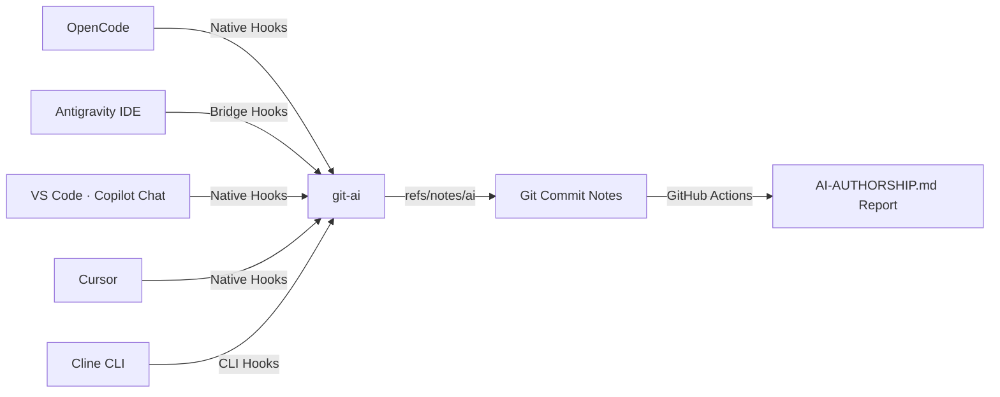

# 🤖 AI Authorship

> Automated AI authorship attribution and GitHub Markdown reporting powered by [git-ai](https://usegitai.com).

[](LICENSE)
[](.github/workflows/authorship-report.yml)
[](#-requirements)
[](https://usegitai.com)

Every commit gets a `git note` tracking which AI agent (or human) wrote each line of code.

This repository includes four agent integrations out-of-the-box:
- ⚡ **OpenCode** — Native integration (no bridge required).
- 🛸 **Antigravity IDE** (Gemini CLI) — via a lightweight PowerShell/Windows bridge in [`bridge/`](file:///c:/Users/calim/ai-authorship/bridge).
- ⚡ **VS Code / GitHub Copilot Chat** — via native Copilot hooks (`~/.copilot/hooks/git-ai.json`).
- 🛠️ **Cursor** — via native Cursor agent hooks (`~/.cursor/hooks.json`).
- 🛠️ **Cline** — via CLI PreToolUse hooks with an apply-and-restore bridge (`~/.cline/hooks/PreToolUse.ps1`).

A GitHub Actions workflow automatically reads the attribution notes and generates a live [`AI-AUTHORSHIP.md`](file:///c:/Users/calim/ai-authorship/AI-AUTHORSHIP.md) report on every push to `main`.

> [!NOTE]
> **This repo is a live example!** The [`AI-AUTHORSHIP.md`](file:///c:/Users/calim/ai-authorship/AI-AUTHORSHIP.md) at the root was generated by this exact setup from this repo's own commits.

---

## 📑 Table of Contents

- [How It Works](#-how-it-works)
- [Requirements](#-requirements)
- [Quick Start](#-quick-start)
  - [1. Install git-ai](#1-install-git-ai)
  - [2. OpenCode Setup (Native)](#2-opencode-setup-native)
  - [3. VS Code & GitHub Copilot Chat Setup (Native)](#3-vs-code--github-copilot-chat-setup-native)
  - [4. Cursor Setup (Native Hooks)](#4-cursor-setup-native-hooks)
  - [5. Cline Setup (CLI Hooks)](#5-cline-setup-cli-hooks)
  - [6. Antigravity IDE Setup (Windows Bridge)](#6-antigravity-ide-setup-windows-bridge)
  - [7. Verify Your First Attributed Edit](#7-verify-your-first-attributed-edit)
  - [8. Publish the CI Report](#8-publish-the-ci-report)
- [Supported Agents](#supported-agents)
- [Workflows for Different Situations](#workflows-for-different-situations)
- [Configuration](#%EF%B8%8F-configuration)
- [Troubleshooting](#-troubleshooting)
- [Project Layout](#-project-layout)
- [License](#-license)

---

## ⚙️ How It Works



1. **Checkpoint:** As agents edit files, `git-ai` records checkpoints containing session IDs, tools used, file paths, and transcript details.
2. **Attribution Note:** On `git commit`, `git-ai` sweeps pending checkpoints and attaches a structured attribution note (`refs/notes/ai`) to the commit.
3. **CI Reporting:** The GitHub Actions workflow ([`workflow/authorship-report.yml`](file:///c:/Users/calim/ai-authorship/workflow/authorship-report.yml)) parses the notes and updates [`AI-AUTHORSHIP.md`](file:///c:/Users/calim/ai-authorship/AI-AUTHORSHIP.md) on `main`.

---

## 📋 Requirements

| Tool / Environment | Version / Target | Purpose |
| :--- | :--- | :--- |
| **git-ai CLI** | v1.6.0+ | Tracks line-by-line attribution notes |
| **Windows OS** | Windows 10/11 | Required for Antigravity bridge (`bridge/`) |
| **OpenCode** | v1.12+ | Native `git-ai` integration |
| **VS Code** | 1.109.3+ | Copilot Chat hooks (`~/.copilot/hooks/git-ai.json`) + `chat.useHooks: true` |
| **Cursor** | Agent Hooks supported | Native Cursor hooks (`~/.cursor/hooks.json`) |
| **Cline** | CLI 3.x (Windows) | CLI PreToolUse hooks + apply/restore bridge (`~/.cline/hooks/PreToolUse.ps1`) |
| **Antigravity IDE** | Gemini CLI hooks enabled | Supported via `bridge/install.cmd` |
| **GitHub Actions** | Standard runner (Ubuntu) | Automated Markdown report generation |

---

## 🧰 Supported Agents

| Agent / IDE | Integration | Setup |
| :--- | :--- | :--- |
| **OpenCode** (TUI + IDE extension) | Native plugin (auto-installed) | `git-ai install-hooks` |
| **Antigravity IDE** (Gemini CLI) | Windows bridge (`bridge/`) | `cd bridge && install.cmd` |
| **VS Code** (Copilot Chat) | Native hooks (`~/.copilot/hooks/git-ai.json`) + optional extension | `git-ai install-hooks` |
| **GitHub Copilot** | Native hooks | `git-ai install-hooks` |
| **Cursor** | Native hooks (`~/.cursor/hooks.json`) | `git-ai install-hooks` |
| **Cline CLI** | CLI hooks bridge (`~/.cline/hooks/PreToolUse.ps1`) | Copy from `bridge/cline/` (see §5) |
| **Claude Code · Windsurf · Codex · Continue CLI · Amp · Pi · AI Tab · Firebender** | Checkpoint presets | `git-ai checkpoint <preset>` |

> [!NOTE]
> The OpenCode, Antigravity IDE, VS Code / Copilot Chat, and Cursor integrations
> are all documented and tested against this repository (plus the
> [game-of-life](https://github.com/CaliMark/game-of-life) live example, which
> shows `gemini`, `opencode`, `github-copilot`, and `cursor` all attributed in one
> repo); the rest are supported by `git-ai` and use the same `refs/notes/ai`
> attribution.
>
> VS Code attribution comes from the `~/.copilot/hooks/git-ai.json` hooks, not the
> extension. Enable it with `"chat.useHooks": true` in VS Code user settings. The
> git-ai extension is useful but optional on modern VS Code (1.109.3+) — it adds
> the in-editor blame lens (Ctrl+Shift+A) and AI-tab tracking, and is
> auto-installed by `git-ai install-hooks`. The Copilot model is resolved from
> session data (e.g. `github-copilot · claude-haiku-4.5`).
>
> Cursor attribution comes from Cursor's native agent hooks
> (`~/.cursor/hooks.json`), which `git-ai install-hooks` writes automatically. The
> model label comes straight from Cursor's hook payload (e.g.
> `cursor · composer-2.5-fast`).
>
> Cline attribution works for both the **VS Code extension** (git-ai's official
> Cline installer targets `~/Documents/Cline/Hooks/` with `PreToolUse` +
> `PostToolUse`) and the **Cline CLI** (`~/.cline/hooks/`). The CLI fires *only*
> `PreToolUse` — before the edit is applied — so a naive snapshot would capture
> pre-edit content and produce no claim. The bundled `PreToolUse.ps1` bridge
> applies the edit first, snapshots post-edit content, then restores the original
> bytes so Cline's own apply still succeeds. The model label resolves from
> `~/.cline/data/settings/providers.json` (e.g. `cline · nemotron-3.5-lightning`).
> When using the Cline extension hooks, **disable the git-ai VS Code extension**
> — its save-based KnownHuman listener races the Cline `PostToolUse` hook and
> can steal the claim (first-claim-wins).

---

## 🚀 Quick Start

> [!NOTE]
> The Antigravity IDE Windows bridge, the VS Code / Copilot Chat hooks, and the
> Cursor agent hooks have all been fully tested and verified directly on this
> repository (and the
> [game-of-life](https://github.com/CaliMark/game-of-life) live example).

### 1. Install git-ai

Download `git-ai` for your platform from [usegitai.com](https://usegitai.com) and add it to your `PATH`.
*Note: The bridge auto-detects `~/.git-ai/bin/git-ai.exe` or the `GIT_AI_BIN` environment variable.*

### 2. OpenCode Setup (Native)

Run in your terminal:

```bash
git-ai install-hooks
```

That’s it! OpenCode sessions will automatically attribute code edits.

> [!NOTE]
> Attribution is **provider-agnostic** — it tracks the OpenCode *session*, not the
> upstream model. Routing through OpenRouter (or any proxy / custom provider) works
> identically; only the model label in the report changes, e.g.
> `opencode · openrouter/anthropic/claude-sonnet-4`. For custom providers defined in
> `opencode.json`, use a short readable model `id`, since that string appears
> verbatim in the report.

---

### 3. VS Code & GitHub Copilot Chat Setup (Native)

Attribution in GitHub Copilot Chat uses the native Copilot hooks file, plus one
setting in VS Code.

1. Set `"chat.useHooks": true` in VS Code user settings (`settings.json`).
2. Run in your terminal:

```bash
git-ai install-hooks
```

That’s it — `git-ai` writes `~/.copilot/hooks/git-ai.json`, and Copilot Chat
edits are attributed automatically. Verified live: Copilot Chat commits in the
[game-of-life](https://github.com/CaliMark/game-of-life) repo show
`github-copilot · claude-haiku-4.5` attribution with the full session note.

> [!NOTE]
> The git-ai VS Code extension is optional (VS Code 1.109.3+) — it adds the
> in-editor blame lens (Ctrl+Shift+A) and AI-tab tracking, and is auto-installed
> by `git-ai install-hooks`. Attribution itself comes from the hooks file, not
> the extension.

---

### 4. Cursor Setup (Native Hooks)

Attribution in Cursor uses its native agent hooks file.

1. Run in your terminal:

```bash
git-ai install-hooks
```

That's it — `git-ai` writes `~/.cursor/hooks.json` (with `preToolUse` /
`postToolUse` events), and Cursor edits are attributed automatically. The model
label comes straight from Cursor's hook payload (e.g.
`cursor · composer-2.5-fast`). Verified live: a Cursor edit committed in the
[game-of-life](https://github.com/CaliMark/game-of-life) repo shows
`100% AI | agent: cursor` attribution.

---

### 5. Cline Setup (CLI Hooks)

Attribution in the **Cline CLI** uses a `PreToolUse` hook bridge in `~/.cline/hooks/`.

> [!NOTE]
> The **Cline VS Code extension** reads hooks from `~/Documents/Cline/Hooks/` and
> fires **both** `PreToolUse` and `PostToolUse` — so a plain `PostToolUse` hook
> suffices there (no apply/restore needed; the edit is already on disk). The
> bundled `bridge/cline/PostToolUse.ps1` is that hook.
>
> On Windows, git-ai's built-in Cline installer **skips Cline entirely**
> (`"Cline hooks are not supported on Windows today"`), so the extension hooks
> must be placed manually. The steps below target the **Cline CLI**, which reads
> hooks from `~/.cline/hooks/` and fires **only** `PreToolUse` (no
> `PostToolUse`), so it needs the apply-and-restore bridge.

1. Copy the bridge into place:

```powershell
copy bridge\cline\PreToolUse.ps1 "$env:USERPROFILE\.cline\hooks\PreToolUse.ps1"
```

2. Restart your Cline CLI session so it picks up the hook.

That's it. The bridge:

- **Snapshots post-edit content** — for `editor` / `edit` it replaces
  `old_text` → `new_text` on disk before the checkpoint; for `write_to_file` /
  `write` it writes the new content directly.
- **Runs `git-ai checkpoint cline`** against a `PostToolUse`-shaped payload, so
  the daemon records an `AiAgent` checkpoint with the *post-edit* blob.
- **Restores the original bytes** after a short delay, so Cline's own editor
  apply still succeeds on the untouched file.
- Resolves the model label from `~/.cline/data/settings/providers.json`
  (`lastUsedProvider` → model), e.g. `cline · nemotron-3.5-lightning`.

Verified live: a Cline CLI edit committed in the
[game-of-life](https://github.com/CaliMark/game-of-life) repo shows
`cline · nemotron-3.5-lightning` attribution (commit `fc81dca`).

**Cline VS Code extension (Windows):** install the extension, then copy the
plain `PostToolUse` hook (no apply/restore — the edit is already applied when
`PostToolUse` fires):

```powershell
copy bridge\cline\PostToolUse.ps1 "$env:USERPROFILE\Documents\Cline\Hooks\PostToolUse.ps1"
```

Then verify an extension-driven edit attributes to `cline` on commit (the
model label resolves from the same `~/.cline/data/settings/providers.json`).
Verified live: a Cline extension edit committed in the
[game-of-life](https://github.com/CaliMark/game-of-life) repo shows
`cline · deepseek-v4-flash` attribution (commit `48ad9b6`).

> [!IMPORTANT]
> **Disable the git-ai VS Code extension** while the Cline extension hooks are
> active. Attribution is **first-claim-wins**: the extension's save-based
> KnownHuman listener races the Cline `PostToolUse` hook for the same edit and
> can win, leaving the commit attributed to `known_human` instead of `cline`.
> Rename/uninstall it (e.g. `...\.vscode\extensions\git-ai.git-ai-vscode-0.1.21`
> → `...\.disabled`) and reload the window before testing, then re-enable it
> after. The Copilot Chat hooks (`~/.copilot/hooks/git-ai.json`) are unaffected —
> they are separate from the extension.

> [!NOTE]
> If both the CLI and the extension run, keep hooks in only one location at a
> time to avoid double-attributing a single edit (`~/.cline/hooks/` = CLI,
> `~/Documents/Cline/Hooks/` = extension).

---

### 6. Antigravity IDE Setup (Windows Bridge)

Run in Command Prompt or PowerShell:

```cmd
cd bridge
install.cmd
```

This merges the `git-ai-attribution` hook into `%USERPROFILE%\.gemini\config\hooks.json` *(a backup is automatically saved)*.

> [!TIP]
> You can customize permissions (allow/ask/deny) for individual agent tools in [`bridge/config.json`](file:///c:/Users/calim/ai-authorship/bridge/config.json).

---

### 7. Verify Your First Attributed Edit

1. Open a Git repository in **Antigravity IDE** and edit any file.
2. Ensure active OpenCode sessions are closed *(an open OpenCode session may claim attribution as `opencode`)*.
3. Run the verification script:

```cmd
bridge\verify-attribution.cmd
```

The script sweeps pending checkpoints, commits your changes, pushes attribution notes, and validates the result (`PASS`/`FAIL`/`MIXED`).

---

### 8. Publish the CI Report

Copy the workflow and report generator scripts into your repository:

```bash
# 1. Copy GitHub workflow template
mkdir -p .github/workflows
cp workflow/authorship-report.yml .github/workflows/

# 2. Copy report script
mkdir -p scripts
cp scripts/authorship-report.sh scripts/

# 3. Commit
git add .github/workflows/authorship-report.yml scripts/authorship-report.sh
git commit -m "ci: add AI authorship report workflow"

# 4. Push (pull with --rebase first: the workflow auto-commits regenerated
#    report updates to main, so a plain push can be rejected)
git-ai await --timeout 30
git pull --rebase origin main
git push origin refs/notes/ai
git push origin main
```

> [!IMPORTANT]
> Keep `GIT_AI_VERSION` inside `.github/workflows/authorship-report.yml` aligned with your local `git-ai` version to maintain schema compatibility.

---

## 🛠️ Configuration

| Setting | Location | Description |
| :--- | :--- | :--- |
| `preToolUseDecisions` | [`bridge/config.json`](file:///c:/Users/calim/ai-authorship/bridge/config.json) | Tool permission rules (`allow` / `ask` / `deny`) |
| `GIT_AI_BIN` | System Environment | Custom path to `git-ai.exe` |
| `GIT_AI_VERSION` | Workflow YAML | `git-ai` CLI version used in CI runs |
| Commit Limits | [`scripts/authorship-report.sh`](file:///c:/Users/calim/ai-authorship/scripts/authorship-report.sh) | Custom depth limits (e.g. `bash scripts/authorship-report.sh 50 25`) |

---

## 🧭 Workflows for Different Situations

### Model routing (OpenRouter, proxies, local models)

Attribution is **provider-agnostic** — `git-ai` tracks the agent session, not the
upstream model. OpenRouter, OpenAI-compatible proxies, or local models (e.g.
Ollama) all work without changes. Only the model label in the report changes to the
provider's model id (e.g. `opencode · openrouter/anthropic/claude-sonnet-4`). For
custom providers defined in `opencode.json`, use a short readable model `id`.

### Multiple agents or sessions in one repo

Keep only the active agent session open. A live OpenCode session can claim edits
made by other tools, so close it before committing work attributed through the
Antigravity bridge.

### Switching models across sessions (e.g. OpenRouter)

When jumping between models — all under OpenCode — open a **new session per model**.
Attribution labels come from the session record, so each model's work gets a clean,
distinct label (e.g. `opencode · big-pickle` vs `opencode · openrouter/...`).
Switching models inside one session muddles attribution, since git-ai can only
resolve a single model label for that session's edits.

It doesn't matter which model performs the final push. Attribution is attached to
each commit when it's made, not when it's pushed, so `AI-AUTHORSHIP.md` lists every
model that wrote lines across all commits — regardless of who ran `git push`. Before
that final push, make sure every session's pending checkpoints are swept:

```bash
git-ai await --timeout 30
git pull --rebase origin main
git push origin refs/notes/ai
git push origin main
```

### Mixed human + AI commits

Attribute human edits with `git-ai checkpoint human` so a single commit can show
both `human` and AI lines. `bridge/verify-attribution.cmd` validates an
end-to-end attributed edit.

### Moving or renaming a repo

Attribution data is keyed by session and commit IDs, not repo paths, so relocating
a repo is safe. Keep the folder name when using the Antigravity bridge, since its
transcripts are keyed by folder name.

### Fresh clones and teammates

History only shows attribution once notes exist locally. On a new clone run
`git-ai fetch-notes` (or `git fetch origin refs/notes/ai:refs/notes/ai`), otherwise
older commits display as `untracked`.

### CI and bot commits

Commits made by the workflow (e.g. `github-actions[bot]` regenerating the report)
have no attribution and correctly show as `untracked`. Merge commits skip stats.

### Web edits (github.com)

Commits created in the github.com web UI (author your account, committer
`GitHub <noreply@github.com>`) never touch local git-ai hooks, so they get no
note and show as `untracked` — not `human`. `human` only appears from an explicit
checkpoint: `git-ai checkpoint human` before committing your own edits, or the
git-ai VS Code extension's save-based KnownHuman attestation. Prefer local edits
if you want manual changes attributed as `human`.

### Pushing from any IDE / terminal

The report regenerates on every push to `main`, regardless of where you push from.
Remember to push the notes ref too:

```bash
git-ai await --timeout 30
git pull --rebase origin main
git push origin refs/notes/ai
git push origin main
```

### Non-GitHub remotes (GitLab, self-hosted)

The GitHub Actions workflow is GitHub-specific. For other remotes, run
`scripts/authorship-report.sh` in your own CI pipeline (or locally) and commit the
generated `AI-AUTHORSHIP.md`.

---

## ❓ Troubleshooting

| Issue | Likely Cause | Solution |
| :--- | :--- | :--- |
| **`verify-attribution.cmd` shows `FAIL / opencode`** | A live OpenCode session claimed the edit. | Close OpenCode, wait ~15 seconds, and commit again. |
| **Cline edit shows `known_human` instead of `cline`** | The git-ai VS Code extension's save-based KnownHuman listener raced the Cline hook (first-claim-wins). | Disable the git-ai extension (rename its `.vscode/extensions/...` folder to `.disabled`), reload the window, and commit again. |
| **`UNKNOWN` or missing agent in notes** | Antigravity hooks are not firing. | Check `bridge/bridge.log`. If missing `RAW` lines, re-run `bridge/install.cmd`. |
| **Report shows `untracked`** | Edits occurred before `git-ai` was configured. | `git-ai` cannot retroactively attribute historical commits. |
| **`git push origin refs/notes/ai` fails** | Remote ref rejection. | Push main first, then manually push note refs (`git push origin refs/notes/ai`). |
| **`git push` rejected: `fetch first`** | The workflow auto-committed a regenerated report to `main` while you were working. | `git-ai await --timeout 30`, then `git pull --rebase origin main` before pushing notes and main. |
| **Report shows a long model id like `openrouter/...`** | Expected — the label reflects the provider's model id. | No action needed. Use a short custom model `id` in `opencode.json` for cleaner labels. |
| **Fresh clone shows everything as `untracked`** | Attribution notes are not fetched with the default clone. | Run `git-ai fetch-notes` (or `git fetch origin refs/notes/ai:refs/notes/ai`). |

---

## 📁 Project Layout

```text
├── bridge/
│   ├── agy-hook.ps1            # Hooks engine: forwards checkpoints & responds to prompts
│   ├── config.json             # Tool permission rules (allow / ask / deny)
│   ├── install.cmd             # Registers hook in ~/.gemini/config/hooks.json
│   ├── uninstall.cmd           # Removes hook registration
│   ├── verify-attribution.cmd  # End-to-end verification script
│   └── cline/
│       ├── PreToolUse.ps1      # Cline CLI hook bridge (apply → snapshot → restore)
│       └── PostToolUse.ps1     # Cline extension hook (snapshot post-edit content)
├── scripts/
│   └── authorship-report.sh    # Core bash script generating AI-AUTHORSHIP.md
├── workflow/
│   └── authorship-report.yml   # GitHub Actions template
├── .github/workflows/          # Active workflow powering this repo's report
└── AI-AUTHORSHIP.md            # Live generated attribution report
```

---

## 📄 License

This project is licensed under the **MIT License** — see the [LICENSE](LICENSE) file for details.
