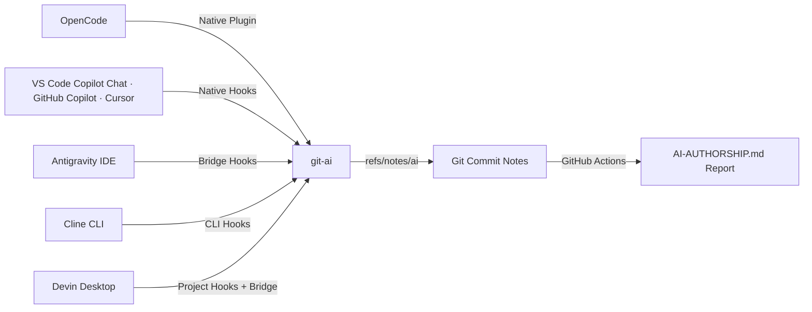

# 🤖 AI Authorship

> Automated AI authorship attribution and GitHub Markdown reporting powered by [git-ai](https://usegitai.com).

[](LICENSE)
[](.github/workflows/authorship-report.yml)
[](#-requirements)
[](https://usegitai.com)

**AI code attribution for every commit** — a `git note` records which AI agent (or human) wrote each line of code.

> [!IMPORTANT]
> **Join the community of devs who want clear, concise, up-front AI vs. human attribution.**

Works out-of-the-box with **six AI coding agents and IDEs**:
- ⚡ **OpenCode** — Native integration (no bridge required).
- 🛸 **Antigravity IDE** (Gemini CLI) — via a lightweight PowerShell/Windows bridge in [`bridge/`](https://github.com/CaliMark/ai-authorship/tree/main/bridge).
- ⚡ **VS Code / GitHub Copilot Chat** — via native Copilot hooks (`~/.copilot/hooks/git-ai.json`).
- 🛠️ **Cursor** — via native Cursor agent hooks (`~/.cursor/hooks.json`).
- 🛠️ **Cline** — via CLI PreToolUse hooks with an apply-and-restore bridge (`~/.cline/hooks/PreToolUse.ps1`).
- 🛠️ **Devin Desktop** (Devin Local) — via project `.devin/hooks.v1.json` hooks calling the `bridge/devin/HookBridge.ps1` adapter.

A GitHub Actions workflow automatically reads the attribution notes and generates a live [`AI-AUTHORSHIP.md`](https://github.com/CaliMark/ai-authorship/blob/main/AI-AUTHORSHIP.md) report on every push to `main`.

> [!NOTE]
> **This project is a running demo — no screenshots needed.**
> - [`AI-AUTHORSHIP.md`](https://github.com/CaliMark/ai-authorship/blob/main/AI-AUTHORSHIP.md) at this repo's root — generated by this exact setup from its own commits (31 commits, 1,936 AI-generated lines across `opencode · big-pickle` and `gemini`).
> - [`game-of-life`](https://github.com/CaliMark/game-of-life) — a second live example with attribution across **8 sources**: `opencode`, `devin`, `github-copilot`, `cline`, `cursor`, `gemini`, a verified **human** edit at commit `b7e37f0` (100% human), and a **fully local model** (`opencode · qwen2.5-7b-instruct` at commit `7b79bd1`) written offline through LM Studio — no cloud.
> - Both reports are regenerated by a GitHub Actions workflow on every push to `main`. Open the repos and verify the attribution yourself — nothing to sign up for.

---

## 📑 Table of Contents

- [How AI Code Attribution Works](#-how-ai-code-attribution-works)
- [Requirements](#-requirements)
- [Quick Start](#-quick-start)
  - [1. Install git-ai](#1-install-git-ai)
  - [2. Native Agents (OpenCode · VS Code Copilot Chat · Cursor)](#2-native-agents-setup-opencode--vs-code-copilot-chat--cursor)
  - [3. Cline Setup (CLI Hooks)](#3-cline-setup-cli-hooks)
  - [4. Devin Desktop Setup (Windows Bridge)](#4-devin-desktop-setup-windows-bridge)
  - [5. Antigravity IDE Setup (Windows Bridge)](#5-antigravity-ide-setup-windows-bridge)
  - [6. Verify Your First Attributed Edit](#6-verify-your-first-attributed-edit)
  - [7. Publish the CI Report](#7-publish-the-ci-report)
- [Agent Support](#-agent-support)
- [Currently Testing](#-currently-testing)
- [Workflows for Different Situations](docs/workflows.md) — AI attribution workflows: model routing (OpenRouter, proxies, local models), multi-agent sessions, mixed human + AI commits, remotes
- [Configuration](#%EF%B8%8F-configuration)
- [Troubleshooting](#-troubleshooting)
- [Project Layout](#-project-layout)
- [License](#-license)

---

## ⚙️ How AI Code Attribution Works



1. **Checkpoint:** As agents edit files, `git-ai` records checkpoints containing session IDs, tools used, file paths, and transcript details.
2. **Attribution Note:** On `git commit`, `git-ai` sweeps pending checkpoints and attaches a structured attribution note (`refs/notes/ai`) to the commit.
3. **CI Reporting:** The GitHub Actions workflow ([`workflow/authorship-report.yml`](https://github.com/CaliMark/ai-authorship/blob/main/workflow/authorship-report.yml)) parses the notes and updates [`AI-AUTHORSHIP.md`](https://github.com/CaliMark/ai-authorship/blob/main/AI-AUTHORSHIP.md) on `main`.

---

## 📋 Requirements

| Tool / Environment | Version / Target | Purpose |
| :--- | :--- | :--- |
| **git-ai CLI** | v1.6.0+ | Tracks line-by-line attribution notes |
| **Windows OS** | Windows 10/11 | Required for the Windows bridges (`bridge/`) |
| **GitHub Actions** | Standard runner (Ubuntu) | Automated Markdown report generation |

See [Agent Support](#-agent-support) below for per-agent versions and setup.

---

## 🧰 Agent Support

### ✅ Tested & verified live

| Agent / IDE | Integration | Setup |
| :--- | :--- | :--- |
| **OpenCode** (TUI + IDE extension) | Native plugin (auto-installed) | `git-ai install-hooks` |
| **Native hooks**: VS Code (Copilot Chat) · GitHub Copilot · Cursor | Auto-installed by git-ai | `git-ai install-hooks` |
| **Antigravity IDE** (Gemini CLI) | Windows bridge (`bridge/`) | `cd bridge && install.cmd` |
| **Cline CLI** | CLI hooks bridge (`~/.cline/hooks/PreToolUse.ps1`) | Copy from `bridge/cline/` (see §3) |
| **Devin Desktop** (Devin Local) | Project hooks + bridge (`bridge/devin/HookBridge.ps1`) | Copy from `bridge/devin/` (see §4) |

> [!NOTE]
> The OpenCode, Antigravity IDE, VS Code / Copilot Chat, Cursor, Cline, and Devin
> integrations are all documented and tested against this repository (plus the
> [game-of-life](https://github.com/CaliMark/game-of-life) live example, which
> shows `gemini`, `opencode`, `github-copilot`, `cursor`, `cline`, and `devin`
> (via Devin Desktop) all attributed in one repo).

### 📦 git-ai checkpoint presets (not tested here yet)

These agents are supported by `git-ai` through `git-ai checkpoint <preset>`, but
we haven't been able to verify them live in this repo yet — most because they
don't offer a free tier to test with:

| Agent | Integration | Setup |
| :--- | :--- | :--- |
| **Claude Code\* · Codex · Amp\* · Pi · AI Tab · Firebender** | Checkpoint presets | `git-ai checkpoint <preset>` |

> [!NOTE]
> **Hobbyist-friendly** — everything here is free and open source (MIT), with no
> accounts or dashboards to sign up for. Happy to test any free AI coding tool:
> open an issue or PR and we'll wire up a bridge and add it to the live examples.
> Agents marked `*` have **no free tier** at the time of writing, so they can't
> be tested live yet — the moment a free tier exists, we'll verify them too.

---

## 🧪 Currently Testing

We validate new setups live and report the honest, in-progress status — no
overclaiming. Anything here is free, open source, and tested by hand before it
moves up to [Agent Support](#-agent-support).

| What | Status | Notes |
| :--- | :--- | :--- |
| **Local / self-hosted models** — LM Studio (Vulkan) + `qwen2.5-7b-instruct` | ✅ Tested & verified live | Real edit attributed as `opencode · qwen2.5-7b-instruct` |

### Local models through LM Studio (self-hosted, no cloud) — verified

Verified live on a Ryzen 3 2200G (4 threads, Vega 8 iGPU, 32 GB RAM): a local
`qwen2.5-7b-instruct` made a real file edit through OpenCode and git-ai
attributed it as `opencode · qwen2.5-7b-instruct` — report generated locally,
no GitHub, no cloud accounts. **Public proof:** the
[`game-of-life`](https://github.com/CaliMark/game-of-life) live example now
includes this exact setup — commit `7b79bd1` was written offline by
`qwen2.5-7b-instruct` through LM Studio and shows as `opencode ·
qwen2.5-7b-instruct` (100% AI) in its
[`AI-AUTHORSHIP.md`](https://github.com/CaliMark/game-of-life/blob/main/AI-AUTHORSHIP.md).

- **App:** [LM Studio](https://lmstudio.ai) — Windows or Linux (AppImage); pick the **Vulkan** backend so AMD/Intel iGPUs and NVIDIA GPUs can offload.
- **Hardware floor:** any AVX2 CPU, **16 GB RAM** (8 GB runs sub-4B models), **~10 GB free disk**. GPU optional — 4 GB+ VRAM speeds it up, but CPU-only still works.
- **Model that works:** `qwen2.5-7b-instruct` **Q4_K_M** (~4.7 GB) — trained for tool use, emits proper `tool_calls`.
- **Model that does NOT work:** `qwen2.5-coder-7b-instruct` — the Coder family was **not trained on tool tokens**; it emits tool calls as `<tools>`/```json``` text in `content` with an empty `tool_calls` array, which the agent can't execute. Verified failing here; use `qwen2.5-instruct` (non-Coder) or `qwen3:8b` (~5–6 GB, best small tool-caller) instead.
- **Gotchas:** at ~3–6 tok/s on a 4-thread CPU each step is slow — a small, sharp prompt ("use the write tool right now") works; an open-ended prompt can get a narration instead of a tool call. Keep GPU offload low on iGPUs — they share the CPU's memory bus, so heavy offload doesn't help.

Self-hosted fits right in: **models** via LM Studio/Ollama, **git** via Gitea/Forgejo/GitLab, **reports** via your own cron or CI — zero cloud accounts anywhere. Attribution is provider-agnostic by design: it tracks the agent session, not the model endpoint.

> **Suggest a model, workflow, or tool** — open an issue or PR and we'll wire up a bridge and add it to the live examples.

---

## 🚀 Quick Start

### 1. Install git-ai

Download `git-ai` for your platform from [usegitai.com](https://usegitai.com) and add it to your `PATH`.
*Note: The bridge auto-detects `~/.git-ai/bin/git-ai.exe` or the `GIT_AI_BIN` environment variable.*

### 2. Native Agents Setup (OpenCode · VS Code Copilot Chat · Cursor)

Run once — `git-ai install-hooks` installs hooks for OpenCode, VS Code / Copilot
Chat, and Cursor automatically. For Copilot Chat, also set `"chat.useHooks": true`
in VS Code user settings.

> [!NOTE]
> Attribution is **provider-agnostic** — it tracks the OpenCode *session*, not the
> upstream model. Routing through OpenRouter (or any proxy / custom provider) works
> identically; only the model label in the report changes, e.g.
> `opencode · openrouter/anthropic/claude-sonnet-4`. For custom providers defined in
> `opencode.json`, use a short readable model `id`, since that string appears
> verbatim in the report.

Verified live: `github-copilot · claude-haiku-4.5` (Copilot Chat) and
`cursor · composer-2.5-fast` (Cursor) commits in the
[game-of-life](https://github.com/CaliMark/game-of-life) repo.

---

> [!NOTE]
> **Get the bridge files — either:**
> - **Clone/fork this repo** (recommended if you want the full template,
>   workflows, and examples), **or**
> - **Download the package** from the latest release (no git needed):
>
> ```powershell
> Invoke-WebRequest -Uri "https://github.com/CaliMark/ai-authorship/releases/latest/download/bridge.zip" -OutFile bridge.zip
> Expand-Archive -Path bridge.zip -DestinationPath . -Force
> ```
>
> Both produce the same `bridge\` folder, so the `copy bridge\...` and
> `cd bridge; install.cmd` commands in §3–§5 work identically either way.

---

### 3. Cline Setup (CLI Hooks)

Attribution in the **Cline CLI** uses a `PreToolUse` hook bridge in `~/.cline/hooks/`.

> [!NOTE]
> The **Cline VS Code extension** reads hooks from `~/Documents/Cline/Hooks/` and
> fires **both** `PreToolUse` and `PostToolUse` — so a plain `PostToolUse` hook
> suffices there (no apply/restore needed; the edit is already on disk). The
> bundled `bridge/cline/PostToolUse.ps1` is that hook.
>
> On Windows, git-ai's built-in Cline installer **skips Cline entirely**
> (`"Cline hooks are not supported on Windows today"`), so the extension hooks
> must be placed manually. The steps below target the **Cline CLI**, which reads
> hooks from `~/.cline/hooks/` and fires **only** `PreToolUse` (no
> `PostToolUse`), so it needs the apply-and-restore bridge.

1. Copy the bridge into place:

```powershell
copy bridge\cline\PreToolUse.ps1 "$env:USERPROFILE\.cline\hooks\PreToolUse.ps1"
```

2. Restart your Cline CLI session so it picks up the hook.

That's it. The bridge:

- **Snapshots post-edit content** — for `editor` / `edit` it replaces
  `old_text` → `new_text` on disk before the checkpoint; for `write_to_file` /
  `write` it writes the new content directly.
- **Runs `git-ai checkpoint cline`** against a `PostToolUse`-shaped payload, so
  the daemon records an `AiAgent` checkpoint with the *post-edit* blob.
- **Restores the original bytes** after a short delay, so Cline's own editor
  apply still succeeds on the untouched file.
- Resolves the model label from `~/.cline/data/settings/providers.json`
  (`lastUsedProvider` → model), e.g. `cline · nemotron-3.5-lightning`.

Verified live: a Cline CLI edit committed in the
[game-of-life](https://github.com/CaliMark/game-of-life) repo shows
`cline · nemotron-3.5-lightning` attribution (commit `fc81dca`).

**Cline VS Code extension (Windows):** install the extension, then copy the
plain `PostToolUse` hook (no apply/restore — the edit is already applied when
`PostToolUse` fires):

```powershell
copy bridge\cline\PostToolUse.ps1 "$env:USERPROFILE\Documents\Cline\Hooks\PostToolUse.ps1"
```

Then verify an extension-driven edit attributes to `cline` on commit (the
model label resolves from the same `~/.cline/data/settings/providers.json`).
Verified live: a Cline extension edit committed in the
[game-of-life](https://github.com/CaliMark/game-of-life) repo shows
`cline · deepseek-v4-flash` attribution (commit `48ad9b6`).

> [!IMPORTANT]
> **Disable the git-ai VS Code extension** while the Cline extension hooks are
> active. Attribution is **first-claim-wins**: the extension's save-based
> KnownHuman listener races the Cline `PostToolUse` hook for the same edit and
> can win, leaving the commit attributed to `known_human` instead of `cline`.
> Rename/uninstall it (e.g. `...\.vscode\extensions\git-ai.git-ai-vscode-0.1.21`
> → `...\.disabled`) and reload the window before testing, then re-enable it
> after. The Copilot Chat hooks (`~/.copilot/hooks/git-ai.json`) are unaffected —
> they are separate from the extension.

> [!NOTE]
> If both the CLI and the extension run, keep hooks in only one location at a
> time to avoid double-attributing a single edit (`~/.cline/hooks/` = CLI,
> `~/Documents/Cline/Hooks/` = extension).

---

### 4. Devin Desktop Setup (Windows Bridge)

Attribution in **Devin Desktop** (which runs the **Devin Local** agent under the
hood) uses project-level hooks in `.devin/hooks.v1.json` inside the repository.

> [!NOTE]
> Devin Local reads hooks from **project-level** `.devin/hooks.v1.json`
> (the file's `hooks` object is the entire file) or from user-level
> `%APPDATA%\Devin\config.json`. Hooks are discovered **when a session loads**, so
> you must fully quit and reopen Devin Desktop after adding the file.
>
> Devin's hook payload is Claude-Code-compatible but **omits `cwd` and
> `transcript_path`**, and its tool names are lowercase (`edit`, `write`, `exec`).
> The bundled `bridge/devin/HookBridge.ps1` adapts the payload and calls
> `git-ai checkpoint agent-v1` (the generic preset) with `agent_name: "devin"`,
> so Devin edits are attributed to `devin` (not `claude`) in the authorship log.

1. Create `.devin/hooks.v1.json` in your repository root:

```json
{
  "PostToolUse": [
    {
      "matcher": "edit|write|multi_edit|apply_patch|notebook",
      "hooks": [
        {
          "type": "command",
          "command": "powershell -NoProfile -ExecutionPolicy Bypass -File C:/Users/<you>/.git-ai/bridge/devin/HookBridge.ps1"
        }
      ]
    }
  ],
  "PreToolUse": [
    {
      "matcher": "edit|write|multi_edit|apply_patch|notebook",
      "hooks": [
        {
          "type": "command",
          "command": "powershell -NoProfile -ExecutionPolicy Bypass -File C:/Users/<you>/.git-ai/bridge/devin/HookBridge.ps1"
        }
      ]
    }
  ]
}
```

2. Copy the bridge into place (or run it from this repo):

```powershell
copy bridge\devin\HookBridge.ps1 "$env:USERPROFILE\.git-ai\bridge\devin\HookBridge.ps1"
```

3. Fully quit and reopen Devin Desktop so it discovers the new hooks, then make
   an **addition** edit via the Devin agent.

That's it. The bridge:
- Resolves the edited file path from the Devin tool input and sends it as the
  `will_edit_filepaths` (PreToolUse) / `edited_filepaths` (PostToolUse) arrays.
- Adds `cwd` (from `DEVIN_PROJECT_DIR` or the current location) as the
  `repo_working_dir`.
- Looks up the session's real model in `%APPDATA%\Devin\cli\sessions.db` and
  includes it in the checkpoint, so the model label resolves
  (e.g. `devin · swe-1-6-slow`).
- Runs `git-ai checkpoint agent-v1` so the daemon records the `Human` baseline
  (PreToolUse) and `AiAgent` checkpoint (PostToolUse) with `agent_name: "devin"`.

> [!IMPORTANT]
> Use **additions**, not pure deletions, when testing — git-ai cannot attribute a
> commit whose only change removes lines.

Verified live: a Devin Desktop edit committed in the
[game-of-life](https://github.com/CaliMark/game-of-life) repo (commit `150f8a4`)
shows `devin · swe-1-6-slow` attribution via session `various-alibi` (that
commit was recorded by an earlier bridge that attributed via the `claude`
preset; the current bridge records Devin edits directly as `devin`).

---

### 5. Antigravity IDE Setup (Windows Bridge)

Run in Command Prompt or PowerShell:

```cmd
cd bridge
install.cmd
```

This merges the `git-ai-attribution` hook into `%USERPROFILE%\.gemini\config\hooks.json` *(a backup is automatically saved)*.

> [!TIP]
> You can customize permissions (allow/ask/deny) for individual agent tools in [`bridge/config.json`](https://github.com/CaliMark/ai-authorship/blob/main/bridge/config.json).

---

### 6. Verify Your First Attributed Edit

1. Open a Git repository in **Antigravity IDE** and edit any file.
2. Ensure active OpenCode sessions are closed *(an open OpenCode session may claim attribution as `opencode`)*.
3. Run the verification script:

```cmd
bridge\verify-attribution.cmd
```

The script sweeps pending checkpoints, commits your changes, pushes attribution notes, and validates the result (`PASS`/`FAIL`/`MIXED`).

---

### 7. Publish the CI Report

Copy the workflow and report generator scripts into your repository:

```bash
# 1. Copy GitHub workflow template
mkdir -p .github/workflows
cp workflow/authorship-report.yml .github/workflows/

# 2. Copy report script
mkdir -p scripts
cp scripts/authorship-report.sh scripts/

# 3. Commit
git add .github/workflows/authorship-report.yml scripts/authorship-report.sh
git commit -m "ci: add AI authorship report workflow"

# 4. Push (pull with --rebase first: the workflow auto-commits regenerated
#    report updates to main, so a plain push can be rejected)
git-ai await --timeout 30
git pull --rebase origin main
git push origin refs/notes/ai
git push origin main
```

> [!IMPORTANT]
> Keep `GIT_AI_VERSION` inside `.github/workflows/authorship-report.yml` aligned with your local `git-ai` version to maintain schema compatibility.

---

## 🛠️ Configuration

| Setting | Location | Description |
| :--- | :--- | :--- |
| `preToolUseDecisions` | [`bridge/config.json`](https://github.com/CaliMark/ai-authorship/blob/main/bridge/config.json) | Tool permission rules (`allow` / `ask` / `deny`) |
| `GIT_AI_BIN` | System Environment | Custom path to `git-ai.exe` |
| `GIT_AI_VERSION` | Workflow YAML | `git-ai` CLI version used in CI runs |
| Commit Limits | [`scripts/authorship-report.sh`](https://github.com/CaliMark/ai-authorship/blob/main/scripts/authorship-report.sh) | Custom depth limits (e.g. `bash scripts/authorship-report.sh 50 25`) |

---

## 🧭 Workflows for Different Situations

> See [docs/workflows.md](docs/workflows.md) for model routing (OpenRouter,
> proxies, local models), running multiple agents or sessions, switching models,
> mixed human + AI commits, moving/renaming a repo, fresh clones and teammates,
> CI/bot commits, web edits (github.com), pushing from any IDE/terminal, and
> non-GitHub remotes.

---

## ❓ Troubleshooting

| Issue | Likely Cause | Solution |
| :--- | :--- | :--- |
| **`verify-attribution.cmd` shows `FAIL / opencode`** | A live OpenCode session claimed the edit. | Close OpenCode, wait ~15 seconds, and commit again. |
| **Cline edit shows `known_human` instead of `cline`** | The git-ai VS Code extension's save-based KnownHuman listener raced the Cline hook (first-claim-wins). | Disable the git-ai extension (rename its `.vscode/extensions/...` folder to `.disabled`), reload the window, and commit again. |
| **Devin edit shows `devin unknown` (no model)** | The checkpoint was recorded before the bridge could look up the model in `sessions.db`. | Re-make the edit (or the next Devin edit) with the current `bridge/devin/HookBridge.ps1`, then commit. |
| **No Devin hooks fire (`hooks=0` in the Devin log)** | Devin Local discovers hooks only when a session loads, and reads project `.devin/hooks.v1.json` (or `%APPDATA%\Devin\config.json`), not `~/.codeium/...`. | Add `.devin/hooks.v1.json` and fully quit + reopen Devin Desktop before editing. |
| **`UNKNOWN` or missing agent in notes** | Antigravity hooks are not firing. | Check `bridge/bridge.log`. If missing `RAW` lines, re-run `bridge/install.cmd`. |
| **Report shows `untracked`** | Edits occurred before `git-ai` was configured. | `git-ai` cannot retroactively attribute historical commits. |
| **`git push origin refs/notes/ai` fails** | Remote ref rejection. | Push main first, then manually push note refs (`git push origin refs/notes/ai`). |
| **`git push` rejected: `fetch first`** | The workflow auto-committed a regenerated report to `main` while you were working. | `git-ai await --timeout 30`, then `git pull --rebase origin main` before pushing notes and main. |
| **Report shows a long model id like `openrouter/...`** | Expected — the label reflects the provider's model id. | No action needed. Use a short custom model `id` in `opencode.json` for cleaner labels. |
| **Fresh clone shows everything as `untracked`** | Attribution notes are not fetched with the default clone. | Run `git-ai fetch-notes` (or `git fetch origin refs/notes/ai:refs/notes/ai`). |

---

## 📁 Project Layout

```text
├── bridge/
│   ├── agy-hook.ps1            # Hooks engine: forwards checkpoints & responds to prompts
│   ├── config.json             # Tool permission rules (allow / ask / deny)
│   ├── install.cmd             # Registers hook in ~/.gemini/config/hooks.json
│   ├── uninstall.cmd           # Removes hook registration
│   ├── verify-attribution.cmd  # End-to-end verification script
│   └── cline/
│       ├── PreToolUse.ps1      # Cline CLI hook bridge (apply → snapshot → restore)
│       └── PostToolUse.ps1     # Cline extension hook (snapshot post-edit content)
│   └── devin/
│       └── HookBridge.ps1      # Devin Desktop hook bridge (payload adapter + model lookup)
├── scripts/
│   └── authorship-report.sh    # Core bash script generating AI-AUTHORSHIP.md
├── workflow/
│   └── authorship-report.yml   # GitHub Actions template
├── docs/
│   └── workflows.md            # Workflows for different situations (models, sessions, remotes)
├── .github/workflows/          # Active workflow powering this repo's report
└── AI-AUTHORSHIP.md            # Live generated attribution report
```

---

## 📄 License

This project is licensed under the **MIT License** — see the [LICENSE](LICENSE) file for details.
