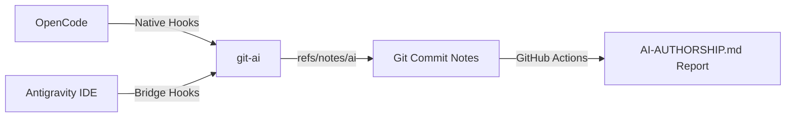

# 🤖 AI Authorship

> Automated AI authorship attribution and GitHub Markdown reporting powered by [git-ai](https://usegitai.com).

[](LICENSE)
[](.github/workflows/authorship-report.yml)
[](#-requirements)
[](https://usegitai.com)

Every commit gets a `git note` tracking which AI agent (or human) wrote each line of code.

This repository includes two agent integrations out-of-the-box:
- ⚡ **OpenCode** — Native integration (no bridge required).
- 🛸 **Antigravity IDE** (Gemini CLI) — via a lightweight PowerShell/Windows bridge in [`bridge/`](file:///c:/Users/calim/ai-authorship/bridge).

A GitHub Actions workflow automatically reads the attribution notes and generates a live [`AI-AUTHORSHIP.md`](file:///c:/Users/calim/ai-authorship/AI-AUTHORSHIP.md) report on every push to `main`.

> [!NOTE]
> **This repo is a live example!** The [`AI-AUTHORSHIP.md`](file:///c:/Users/calim/ai-authorship/AI-AUTHORSHIP.md) at the root was generated by this exact setup from this repo's own commits.

---

## 📑 Table of Contents

- [How It Works](#-how-it-works)
- [Requirements](#-requirements)
- [Quick Start](#-quick-start)
  - [1. Install git-ai](#1-install-git-ai)
  - [2. OpenCode Setup (Native)](#2-opencode-setup-native)
  - [3. Antigravity IDE Setup (Windows Bridge)](#3-antigravity-ide-setup-windows-bridge)
  - [4. Verify Your First Attributed Edit](#4-verify-your-first-attributed-edit)
  - [5. Publish the CI Report](#5-publish-the-ci-report)
- [Configuration](#%EF%B8%8F-configuration)
- [Troubleshooting](#-troubleshooting)
- [Project Layout](#-project-layout)
- [License](#-license)

---

## ⚙️ How It Works



1. **Checkpoint:** As agents edit files, `git-ai` records checkpoints containing session IDs, tools used, file paths, and transcript details.
2. **Attribution Note:** On `git commit`, `git-ai` sweeps pending checkpoints and attaches a structured attribution note (`refs/notes/ai`) to the commit.
3. **CI Reporting:** The GitHub Actions workflow ([`workflow/authorship-report.yml`](file:///c:/Users/calim/ai-authorship/workflow/authorship-report.yml)) parses the notes and updates [`AI-AUTHORSHIP.md`](file:///c:/Users/calim/ai-authorship/AI-AUTHORSHIP.md) on `main`.

---

## 📋 Requirements

| Tool / Environment | Version / Target | Purpose |
| :--- | :--- | :--- |
| **git-ai CLI** | v1.6.0+ | Tracks line-by-line attribution notes |
| **Windows OS** | Windows 10/11 | Required for Antigravity bridge (`bridge/`) |
| **OpenCode** | v1.12+ | Native `git-ai` integration |
| **Antigravity IDE** | Gemini CLI hooks enabled | Supported via `bridge/install.cmd` |
| **GitHub Actions** | Standard runner (Ubuntu) | Automated Markdown report generation |

---

## 🚀 Quick Start

> [!NOTE]
> The Antigravity IDE Windows bridge has been fully tested and verified directly on this repository.

### 1. Install git-ai

Download `git-ai` for your platform from [usegitai.com](https://usegitai.com) and add it to your `PATH`.
*Note: The bridge auto-detects `~/.git-ai/bin/git-ai.exe` or the `GIT_AI_BIN` environment variable.*

### 2. OpenCode Setup (Native)

Run in your terminal:

```bash
git-ai install-hooks
```

That’s it! OpenCode sessions will automatically attribute code edits.

---

### 3. Antigravity IDE Setup (Windows Bridge)

Run in Command Prompt or PowerShell:

```cmd
cd bridge
install.cmd
```

This merges the `git-ai-attribution` hook into `%USERPROFILE%\.gemini\config\hooks.json` *(a backup is automatically saved)*.

> [!TIP]
> You can customize permissions (allow/ask/deny) for individual agent tools in [`bridge/config.json`](file:///c:/Users/calim/ai-authorship/bridge/config.json).

---

### 4. Verify Your First Attributed Edit

1. Open a Git repository in **Antigravity IDE** and edit any file.
2. Ensure active OpenCode sessions are closed *(an open OpenCode session may claim attribution as `opencode`)*.
3. Run the verification script:

```cmd
bridge\verify-attribution.cmd
```

The script sweeps pending checkpoints, commits your changes, pushes attribution notes, and validates the result (`PASS`/`FAIL`/`MIXED`).

---

### 5. Publish the CI Report

Copy the workflow and report generator scripts into your repository:

```bash
# 1. Copy GitHub workflow template
mkdir -p .github/workflows
cp workflow/authorship-report.yml .github/workflows/

# 2. Copy report script
mkdir -p scripts
cp scripts/authorship-report.sh scripts/

# 3. Commit and push
git add .github/workflows/authorship-report.yml scripts/authorship-report.sh
git commit -m "ci: add AI authorship report workflow"
git push origin main
```

> [!IMPORTANT]
> Keep `GIT_AI_VERSION` inside `.github/workflows/authorship-report.yml` aligned with your local `git-ai` version to maintain schema compatibility.

---

## 🛠️ Configuration

| Setting | Location | Description |
| :--- | :--- | :--- |
| `preToolUseDecisions` | [`bridge/config.json`](file:///c:/Users/calim/ai-authorship/bridge/config.json) | Tool permission rules (`allow` / `ask` / `deny`) |
| `GIT_AI_BIN` | System Environment | Custom path to `git-ai.exe` |
| `GIT_AI_VERSION` | Workflow YAML | `git-ai` CLI version used in CI runs |
| Commit Limits | [`scripts/authorship-report.sh`](file:///c:/Users/calim/ai-authorship/scripts/authorship-report.sh) | Custom depth limits (e.g. `bash scripts/authorship-report.sh 50 25`) |

---

## ❓ Troubleshooting

| Issue | Likely Cause | Solution |
| :--- | :--- | :--- |
| **`verify-attribution.cmd` shows `FAIL / opencode`** | A live OpenCode session claimed the edit. | Close OpenCode, wait ~15 seconds, and commit again. |
| **`UNKNOWN` or missing agent in notes** | Antigravity hooks are not firing. | Check `bridge/bridge.log`. If missing `RAW` lines, re-run `bridge/install.cmd`. |
| **Report shows `untracked`** | Edits occurred before `git-ai` was configured. | `git-ai` cannot retroactively attribute historical commits. |
| **`git push origin refs/notes/ai` fails** | Remote ref rejection. | Push main first, then manually push note refs (`git push origin refs/notes/ai`). |

---

## 📁 Project Layout

```text
├── bridge/
│   ├── agy-hook.ps1            # Hooks engine: forwards checkpoints & responds to prompts
│   ├── config.json             # Tool permission rules (allow / ask / deny)
│   ├── install.cmd             # Registers hook in ~/.gemini/config/hooks.json
│   ├── uninstall.cmd           # Removes hook registration
│   └── verify-attribution.cmd  # End-to-end verification script
├── scripts/
│   └── authorship-report.sh    # Core bash script generating AI-AUTHORSHIP.md
├── workflow/
│   └── authorship-report.yml   # GitHub Actions template
├── .github/workflows/          # Active workflow powering this repo's report
└── AI-AUTHORSHIP.md            # Live generated attribution report
```

---

## 📄 License

This project is licensed under the **MIT License** — see the [LICENSE](LICENSE) file for details.
